# ReClaim AI - Lost & Found Management System

An AI-powered lost and found management platform that uses LLM-based semantic matching and blockchain verification to help reunite people with their lost items.

## Features

### Core Features

- **AI-Powered Item Recognition** - Upload images and let AI identify and describe items
- **Smart Matching** - Automatic matching between lost and found items using semantic + visual similarity
- **Real-time Chat** - Conversational AI interface to report lost/found items
- **Admin Dashboard** - Manage all reported items, users, and matches
- **Credits System** - Reward users for reporting found items
- **Location Picker** - Search and select locations with interactive map

### CCTV Intelligence

- **Live Webcam Detection** - Real-time object detection using YOLOv8
- **Video Analysis** - Upload surveillance footage to find lost items
- **Keyframe Extraction** - Automatically captures timestamps when items appear
- **Groq AI Analysis** - Semantic analysis with match confidence scoring
- **One-Click Registration** - Register detected objects as found items

### Blockchain Verification

- **Ethereum (Sepolia)** - Handover transactions recorded on blockchain
- **Immutable Records** - Tamper-proof verification of item transfers
- **Smart Contracts** - Automated handover verification

### AI Technologies

- **YOLOv8** - Real-time object detection for CCTV
- **Groq/Gemini LLM** - Natural language understanding
- **Clarifai** - Visual similarity matching for images
- **LangGraph** - Stateful AI workflows

## Project Structure

```
ReClaim-AI/
├── client/              # React + Vite frontend
│   ├── src/
│   │   ├── components/  # Reusable UI components
│   │   ├── pages/       # Page components (User, Admin)
│   │   ├── services/    # API service functions
│   │   ├── context/     # React context providers
│   │   ├── hooks/       # Custom React hooks
│   │   └── lib/         # Utilities, icons, Firebase
│   └── package.json
├── server/              # Express + TypeScript backend
│   ├── src/
│   │   ├── routes/      # API endpoints
│   │   ├── services/    # Business logic (matching, handover, blockchain)
│   │   ├── middleware/  # Auth middleware
│   │   ├── graph/       # LangGraph AI workflows
│   │   └── utils/       # LLM, email utilities
│   └── package.json
├── models/              # Python YOLO service
│   ├── app.py           # Flask API for object detection
│   └── requirements.txt # Python dependencies
├── .env.example         # Environment variables template
└── README.md
```

## Quick Start

### Prerequisites

- Node.js 18+
- Python 3.9+ (for YOLO service)
- npm or yarn
- Firebase project
- Cloudinary account (for image storage)
- Groq/Gemini API key (for AI)

### 1. Clone & Install

```bash
git clone https://github.com/Vinay-R-S/ReClaim-AI.git
cd ReClaim-AI

# Install client dependencies
cd client
npm install

# Install server dependencies
cd ../server
npm install

# Install Python dependencies (for CCTV)
cd ..
python -m venv .venv
.venv\Scripts\activate  # Windows
# source .venv/bin/activate  # macOS/Linux
pip install -r models/requirements.txt
```

### 2. Configure Environment Variables

Copy the example file and fill in your values:

```bash
cp .env.example .env
```

Then edit `.env` with your credentials (see [Environment Variables](#-environment-variables) section below).

### 3. Run Development Servers

**Terminal 1 - Python YOLO Service:**

```bash
.venv\Scripts\python models\app.py
# Runs on http://localhost:5000
```

**Terminal 2 - Node.js Backend:**

```bash
cd server
npm run dev
# Runs on http://localhost:3001
```

**Terminal 3 - React Frontend:**

```bash
cd client
npm run dev
# Runs on http://localhost:5173
```

**Access Points:**

- Frontend: http://localhost:5173
- Backend API: http://localhost:3001
- YOLO Service: http://localhost:5000

## Environment Variables

### Client Variables (prefix: `VITE_`)

| Variable                            | Description               | How to Get                                                                           |
| ----------------------------------- | ------------------------- | ------------------------------------------------------------------------------------ |
| `VITE_FIREBASE_API_KEY`             | Firebase Web API Key      | [Firebase Console](https://console.firebase.google.com) → Project Settings → General |
| `VITE_FIREBASE_AUTH_DOMAIN`         | Firebase Auth Domain      | Same as above, format: `{project-id}.firebaseapp.com`                                |
| `VITE_FIREBASE_PROJECT_ID`          | Firebase Project ID       | Same as above                                                                        |
| `VITE_FIREBASE_STORAGE_BUCKET`      | Firebase Storage Bucket   | Same as above, format: `{project-id}.appspot.com`                                    |
| `VITE_FIREBASE_MESSAGING_SENDER_ID` | Messaging Sender ID       | Same as above                                                                        |
| `VITE_FIREBASE_APP_ID`              | Firebase App ID           | Same as above                                                                        |
| `VITE_ADMIN_EMAIL`                  | Admin user's email        | Your admin email address                                                             |
| `VITE_GROQ_API_KEY`                 | Groq API Key (optional)   | [Groq Console](https://console.groq.com)                                             |
| `VITE_GEMINI_API_KEY`               | Gemini API Key (optional) | [Google AI Studio](https://aistudio.google.com/apikey)                               |
| `VITE_GEOAPIFY_API_KEY`             | Geoapify API Key          | [Geoapify](https://myprojects.geoapify.com/)                                         |
| `VITE_API_URL`                      | Backend API URL           | Default: `http://localhost:3001`                                                     |

### Server Variables

| Variable                       | Description                         | How to Get                                                        |
| ------------------------------ | ----------------------------------- | ----------------------------------------------------------------- |
| `GROQ_API_KEY`                 | Groq API Key for LLM                | [Groq Console](https://console.groq.com)                          |
| `GEMINI_API_KEY`               | Gemini API Key for LLM              | [Google AI Studio](https://aistudio.google.com/apikey)            |
| `FIREBASE_SERVICE_ACCOUNT_KEY` | Base64 encoded service account JSON | See [Firebase Admin Setup](#firebase-admin-sdk-setup)             |
| `FIREBASE_PROJECT_ID`          | Firebase Project ID                 | Firebase Console                                                  |
| `CLOUDINARY_CLOUD_NAME`        | Cloudinary Cloud Name               | [Cloudinary Console](https://console.cloudinary.com/) → Dashboard |
| `CLOUDINARY_API_KEY`           | Cloudinary API Key                  | Same as above                                                     |
| `CLOUDINARY_API_SECRET`        | Cloudinary API Secret               | Same as above                                                     |
| `RESEND_API_KEY`               | Resend API Key for emails           | [Resend Dashboard](https://resend.com/)                           |
| `FROM_EMAIL`                   | Sender email address                | Your verified domain email                                        |
| `CLIENT_URL`                   | Frontend URL                        | Default: `http://localhost:5173`                                  |
| `PORT`                         | Server port                         | Default: `3001`                                                   |
| `ADMIN_PRIVATE_KEY`            | Ethereum wallet private key         | See [Blockchain Setup](#blockchain-setup-ethereum-sepolia)        |
| `CONTRACT_ADDRESS`             | Deployed smart contract address     | See [Blockchain Setup](#blockchain-setup-ethereum-sepolia)        |

## Detailed Setup Guides

### Firebase Setup

1. Go to [Firebase Console](https://console.firebase.google.com/)
2. Create a new project (or use existing)
3. Enable **Authentication** → Sign-in method → Google
4. Enable **Firestore Database** → Create in production mode
5. Enable **Storage** (optional, we use Cloudinary)
6. Go to **Project Settings** → General → Your apps → Add web app
7. Copy the config values to your `.env` file

### Firebase Admin SDK Setup

1. Go to **Project Settings** → **Service Accounts**
2. Click **Generate New Private Key**
3. Download the JSON file
4. Encode it to Base64:

   ```bash
   # On macOS/Linux
   base64 -i path/to/serviceAccountKey.json

   # On Windows PowerShell
   [Convert]::ToBase64String([IO.File]::ReadAllBytes("path\to\serviceAccountKey.json"))
   ```

5. Copy the entire Base64 string to `FIREBASE_SERVICE_ACCOUNT_KEY`

### Cloudinary Setup

1. Go to [Cloudinary Console](https://console.cloudinary.com/)
2. Sign up for a free account
3. From Dashboard, copy:
   - Cloud Name → `CLOUDINARY_CLOUD_NAME`
   - API Key → `CLOUDINARY_API_KEY`
   - API Secret → `CLOUDINARY_API_SECRET`

### Clarifai Setup (Required for Image Matching)

1. Go to [https://clarifai.com](https://clarifai.com)
2. Sign up or log in
3. Navigate to Settings → Security
4. Create a new Personal Access Token (PAT)
5. Copy the token and add it to `.env`:

   ```bash
   # Clarifai API Configuration
   CLARIFAI_PAT=your_clarifai_personal_access_token_here

   # Optional: Custom Clarifai settings (defaults shown)
   # CLARIFAI_USER_ID=clarifai
   # CLARIFAI_APP_ID=main
   # CLARIFAI_MODEL_ID=general-image-recognition
   ```

   _Note: Image matching functionality relies on this service._

### Groq API Setup

1. Go to [Groq Console](https://console.groq.com/)
2. Sign up (free tier available)
3. Create an API key
4. Copy to `GROQ_API_KEY` and `VITE_GROQ_API_KEY`

### Gemini API Setup

1. Go to [Google AI Studio](https://aistudio.google.com/apikey)
2. Create an API key
3. Copy to `GEMINI_API_KEY` and `VITE_GEMINI_API_KEY`

### Geoapify Setup (for Location Picker)

1. Go to [Geoapify](https://myprojects.geoapify.com/)
2. Create a free account and project
3. Get your API key
4. Copy to `VITE_GEOAPIFY_API_KEY`

### Blockchain Setup (Ethereum Sepolia)

The blockchain feature records handover transactions on the Ethereum Sepolia testnet for tamper-proof verification.

**1. Create a Wallet**

- Install [MetaMask](https://metamask.io/) browser extension
- Create a new wallet or import existing
- Switch to **Sepolia Test Network**
- Copy your **private key** (Account → Export Private Key)

> [!CAUTION]
> Never share or commit your private key. Keep it secret!

**2. Get Sepolia Test ETH**

You need test ETH for gas fees (free):

- [Alchemy Sepolia Faucet](https://sepoliafaucet.com/) - Requires Alchemy account
- [Infura Sepolia Faucet](https://www.infura.io/faucet/sepolia) - Requires Infura account
- [Google Cloud Sepolia Faucet](https://cloud.google.com/application/web3/faucet/ethereum/sepolia)

**3. Deploy the Smart Contract**

The handover contract is located at `contracts/` (if not already deployed):

```bash
# Using Hardhat or Remix to deploy
# After deployment, copy the contract address
```

**4. Configure Environment Variables**

```bash
# In .env file
ADMIN_PRIVATE_KEY=your_wallet_private_key_here
CONTRACT_ADDRESS=0x_your_deployed_contract_address
```

**5. Verify Setup**

When the server starts, you should see:

```
Blockchain service initialized
   Admin wallet: 0x...
   Contract: 0x...
   RPC: https://ethereum-sepolia-rpc.publicnode.com
```

## Firestore Indexes

If you see Firestore index errors, create these composite indexes:

1. **creditTransactions** collection:
   - `userId` (Ascending) + `createdAt` (Descending)

2. **items** collection:
   - `reportedBy` (Ascending) + `createdAt` (Descending)

## Tech Stack

### Frontend

- React 18 + TypeScript
- Vite
- TailwindCSS
- Firebase (Auth, Firestore)
- Leaflet (Maps)
- Lucide Icons

### Backend (Node.js)

- Node.js + Express
- TypeScript
- Firebase Admin SDK
- Cloudinary (Image storage)
- Groq/Gemini (AI/LLM)
- LangGraph (AI workflows)
- Resend (Email)
- Ethers.js (Blockchain)

### Backend (Python)

- Flask + Flask-CORS
- YOLOv8 (Ultralytics)
- OpenCV
- NumPy

### External Services

- Firebase (Auth, Firestore)
- Cloudinary (Image CDN)
- Clarifai (Image similarity)
- Groq/Gemini (LLM)
- Ethereum Sepolia (Blockchain)
- Geoapify (Geocoding)

## Demo

### Main Page

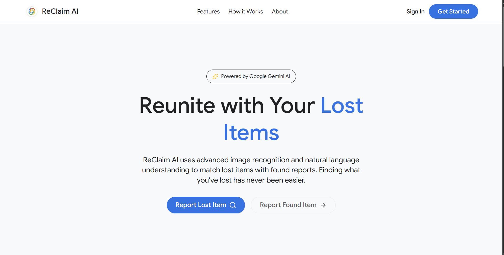

### Authentication

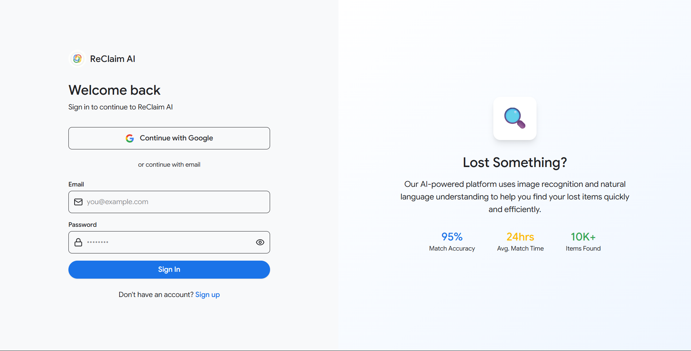

### Admin Dashboard

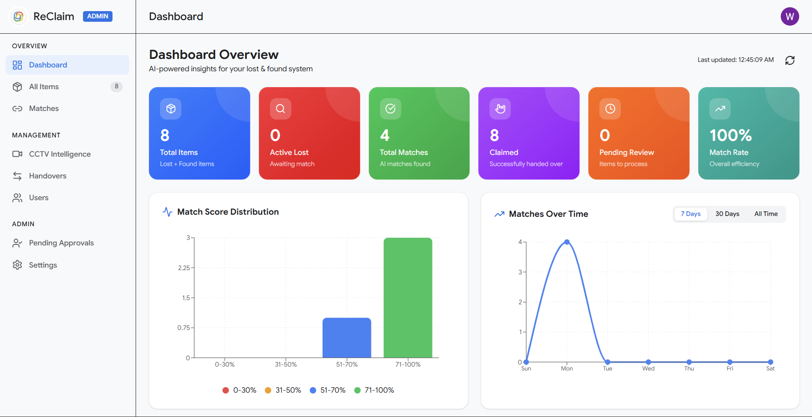

### Report Page

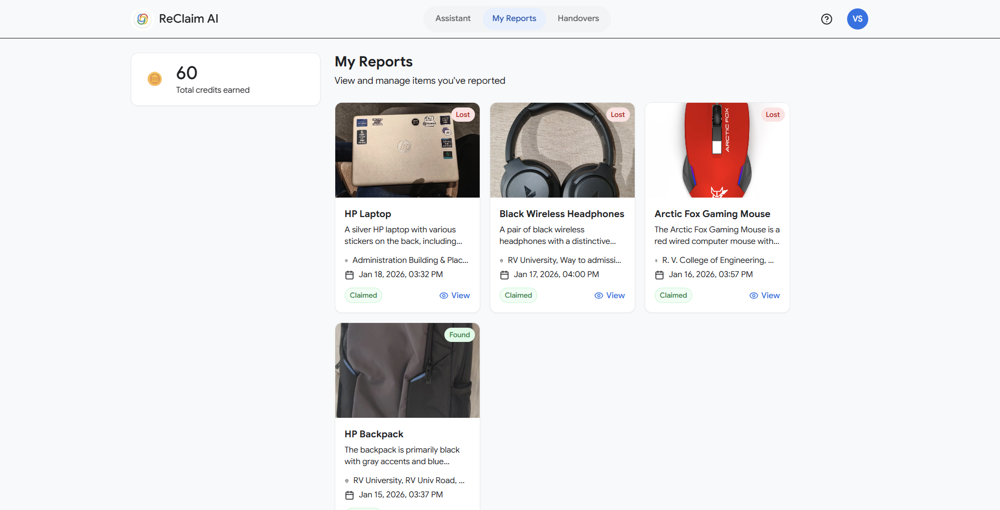

### Report Found Component

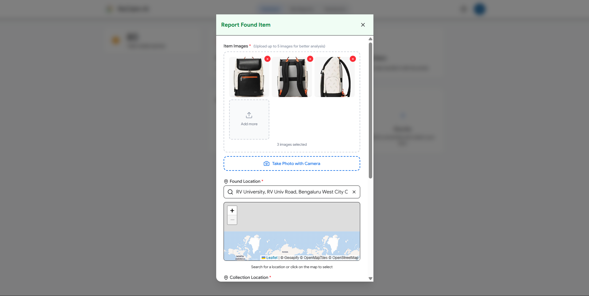

### Pending Approval Page

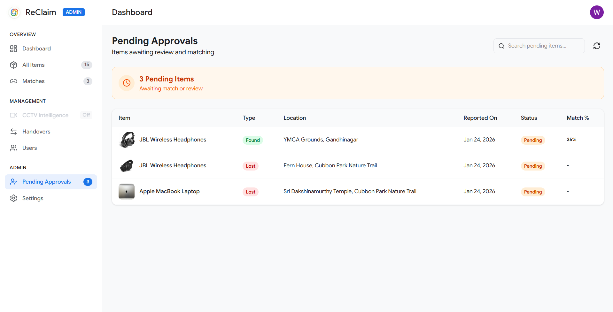

### Handover Page (Admin)

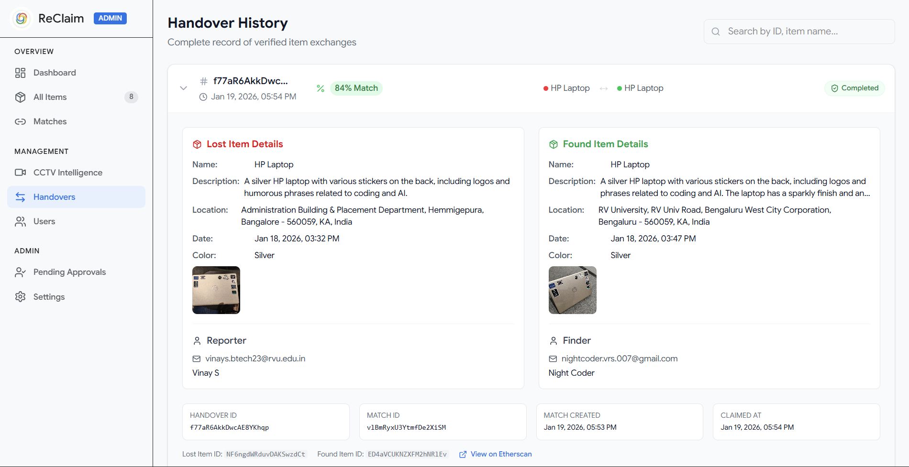

### Handover Page (User)

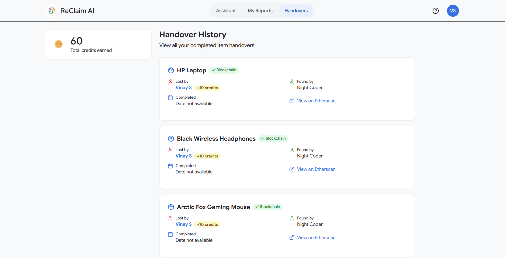

### Profile Page

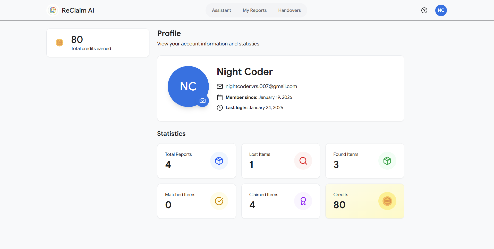

### Settings Page

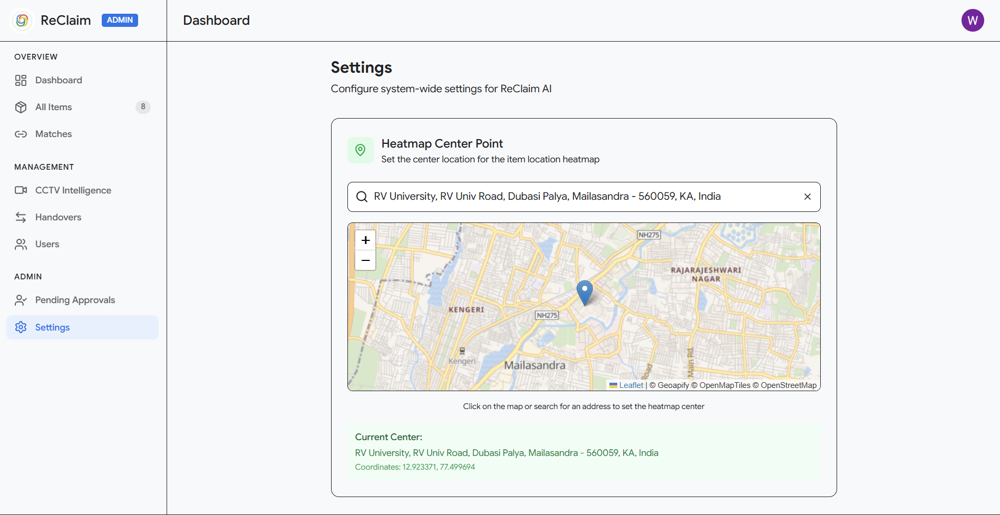

### CCTV Intelligence

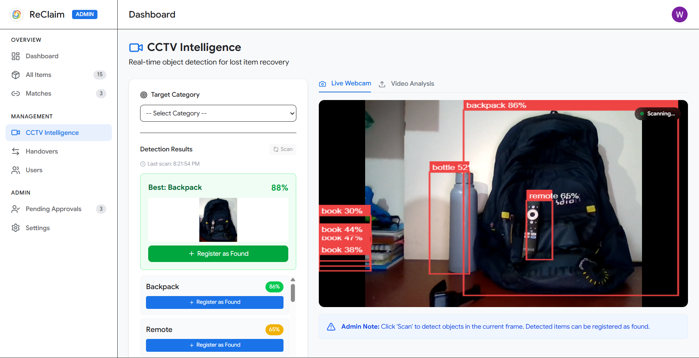

## Contributing

1. Fork the repository
2. Create your feature branch (`git checkout -b feature/amazing-feature`)
3. Commit your changes (`git commit -m 'Add amazing feature'`)
4. Push to the branch (`git push origin feature/amazing-feature`)
5. Open a Pull Request

## License

**All Rights Reserved** © 2025 ReClaim AI Team

This project and its source code are proprietary. Unauthorized copying, modification, distribution, or use of this software is strictly prohibited without explicit written permission from the authors.

---

## Acknowledgments

- GDG TechSprint Hackathon 2026-27
- Uses Groq's fast inference for AI features
- Maps powered by Geoapify & Leaflet
