# ReClaim AI - Lost & Found Management System

An AI-powered lost and found management platform that uses LLM-based semantic matching and blockchain verification to help reunite people with their lost items.

## Features

### Core Features

- **AI-Powered Item Recognition** - Upload images and let AI identify and describe items
- **Smart Matching** - Automatic matching between lost and found items using semantic + visual similarity
- **Real-time Chat** - Conversational AI interface to report lost/found items
- **Admin Dashboard** - Manage all reported items, users, and matches
- **Credits System** - Reward users for reporting found items
- **Location Picker** - Search and select locations with interactive map

### CCTV Intelligence

- **Live Webcam Detection** - Real-time object detection using YOLOv11
- **Video Analysis** - Upload surveillance footage to find lost items
- **Keyframe Extraction** - Automatically captures timestamps when items appear
- **Groq AI Analysis** - Semantic analysis with match confidence scoring
- **One-Click Registration** - Register detected objects as found items

### Blockchain Verification

- **Ethereum (Sepolia)** - Handover transactions recorded on blockchain
- **Immutable Records** - Tamper-proof verification of item transfers
- **Smart Contracts** - Automated handover verification

### AI Technologies

- **YOLOv11** - Real-time object detection for CCTV
- **Groq / Gemini / Grok** - Item description and the semantic half of matching,
  with the active provider chosen by an admin setting
- **Clarifai** - Visual similarity matching for images

## Project Structure

```
ReClaim-AI/
├── client/              # React + Vite frontend
│   ├── src/
│   │   ├── components/  # UI, split by area (item, admin, landing, ui)
│   │   ├── pages/       # Screens (user, admin, public)
│   │   ├── services/    # One module per API area
│   │   ├── hooks/       # Data access and shared state
│   │   ├── context/     # Auth provider
│   │   ├── types/       # The client's view of the shared contract
│   │   └── lib/         # api client, Firebase, compression, timestamps
│   └── package.json
├── server/              # Express + TypeScript backend
│   ├── src/
│   │   ├── routes/      # Path, middleware, delegate. No logic
│   │   ├── controllers/ # Request in, response out
│   │   ├── services/    # Business logic
│   │   ├── repositories/# Every Firestore query lives here
│   │   ├── schemas/     # zod validation per route group
│   │   ├── middleware/  # auth, roles, validation, rate limits, errors
│   │   ├── types/       # Server types and the shared re-exports
│   │   └── utils/       # llm, logger, scoring, firebase-admin
│   ├── scripts/         # One-off migrations
│   └── package.json
├── models/              # Python YOLO service
│   ├── app.py           # Flask API for object detection
│   └── requirements.txt # Python dependencies
├── shared/
│   └── domain.d.ts      # The one description of every document, imported by both packages
├── docs/
│   ├── architecture/    # C4 diagrams, sequences, state machines, data model, deployment
│   ├── adr/             # Architecture decision records
│   └── api/             # openapi.json, the HTTP contract, checked by a test
├── firestore.rules      # What the browser may read. Deploy with `firebase deploy`
├── firestore.indexes.json
└── README.md
```

## Design documents

| Document                                                           | What it answers                                                 |
| ------------------------------------------------------------------ | --------------------------------------------------------------- |
| [docs/architecture](docs/architecture/README.md)                   | How the system is put together, and which parts are built       |
| [docs/adr](docs/adr/README.md)                                     | Why each significant choice was made, and what would reverse it |
| [docs/api](docs/api/README.md)                                     | The HTTP contract and the versioning policy                     |
| [docs/server-source-structure.md](docs/server-source-structure.md) | What lives where in `server/src`                                |
| [docs/client-source-structure.md](docs/client-source-structure.md) | What lives where in `client/src`                                |

Every diagram marks what exists today against what is designed but not built,
so nothing there can be read as a claim about the running system.

## Quick Start

### Prerequisites

- Node.js 18+
- Python 3.9+ (for YOLO service)
- npm or yarn
- Firebase project
- Cloudinary account (for image storage)
- Groq, Gemini or Grok API key (at least one, for AI)
- Java 21+ (only to run the Firestore rules tests)

### 1. Clone & Install

```bash
git clone https://github.com/Vinay-R-S/ReClaim-AI.git
cd ReClaim-AI

# Install client dependencies
cd client
npm install

# Install server dependencies
cd ../server
npm install

# Install Python dependencies (for CCTV)
cd ..
python -m venv .venv
.venv\Scripts\activate  # Windows
# source .venv/bin/activate  # macOS/Linux
pip install -r models/requirements.txt
```

### 2. Configure Environment Variables

There are two, and the split is the point: the root file is compiled into the
browser bundle and holds nothing secret, while `server/.env` holds every
credential and never reaches the client.

```bash
cp .env.example .env               # client, read by Vite from the repo root
cp server/.env.example server/.env # server, read by the API
```

Then fill both in (see [Environment Variables](#environment-variables) below).
The Flask service needs `YOLO_SERVICE_TOKEN` set to the same value as
`server/.env`, or it refuses every request.

### 3. Run Development Servers

**Terminal 1 - Python YOLO Service:**

```bash
.venv\Scripts\python models\app.py
# Runs on http://localhost:5000
```

**Terminal 2 - Node.js Backend:**

```bash
cd server
npm run dev
# Runs on http://localhost:3001
```

**Terminal 3 - React Frontend:**

```bash
cd client
npm run dev
# Runs on http://localhost:5173
```

**Access Points:**

- Frontend: http://localhost:5173
- Backend API: http://localhost:3001
- YOLO Service: http://localhost:5000

## Environment Variables

### Client Variables (prefix: `VITE_`)

Everything here reaches the browser in the bundle, so nothing secret belongs in
this list. The Groq and Gemini keys used to be here and were readable by anyone
who loaded the site; they are server-side now and every model call goes through
`/api/ai/*`.

| Variable                            | Description             | How to Get                                                                           |
| ----------------------------------- | ----------------------- | ------------------------------------------------------------------------------------ |
| `VITE_FIREBASE_API_KEY`             | Firebase Web API Key    | [Firebase Console](https://console.firebase.google.com) → Project Settings → General |
| `VITE_FIREBASE_AUTH_DOMAIN`         | Firebase Auth Domain    | Same as above, format: `{project-id}.firebaseapp.com`                                |
| `VITE_FIREBASE_PROJECT_ID`          | Firebase Project ID     | Same as above                                                                        |
| `VITE_FIREBASE_STORAGE_BUCKET`      | Firebase Storage Bucket | Same as above, format: `{project-id}.appspot.com`                                    |
| `VITE_FIREBASE_MESSAGING_SENDER_ID` | Messaging Sender ID     | Same as above                                                                        |
| `VITE_FIREBASE_APP_ID`              | Firebase App ID         | Same as above                                                                        |
| `VITE_FIREBASE_MEASUREMENT_ID`      | Analytics ID (optional) | Same as above. Analytics is skipped when absent                                      |
| `VITE_GEOAPIFY_API_KEY`             | Geoapify API Key        | [Geoapify](https://myprojects.geoapify.com/)                                         |
| `VITE_API_URL`                      | Backend API URL         | Default: `http://localhost:3001`                                                     |

The six Firebase values are read at module scope and the app throws on load
without them. The admin is decided by the `role` field on the user document,
not by an email in the bundle.

### Server Variables

| Variable                                              | Required  | Description                                                                                                                                                                                     |
| ----------------------------------------------------- | --------- | ----------------------------------------------------------------------------------------------------------------------------------------------------------------------------------------------- |
| `FIREBASE_SERVICE_ACCOUNT_KEY`                        | Yes       | Base64 encoded service account JSON. See [Firebase Admin Setup](#firebase-admin-sdk-setup)                                                                                                      |
| `FIREBASE_PROJECT_ID`                                 | Yes       | Firebase Project ID                                                                                                                                                                             |
| `HANDOVER_CODE_SECRET`                                | In prod   | HMAC key for handover codes. The server refuses to start in production without at least 32 characters: a six-digit code with no server-side key is reversible by brute force from a leaked hash |
| `GROQ_API_KEY`                                        | One of    | [Groq Console](https://console.groq.com)                                                                                                                                                        |
| `GEMINI_API_KEY`                                      | One of    | [Google AI Studio](https://aistudio.google.com/apikey)                                                                                                                                          |
| `GROK_API_KEY`                                        | One of    | [xAI Console](https://console.x.ai)                                                                                                                                                             |
| `CLARIFAI_PAT`                                        | No        | Personal access token for image similarity                                                                                                                                                      |
| `CLARIFAI_USER_ID`                                    | No        | Clarifai user id                                                                                                                                                                                |
| `CLARIFAI_APP_ID`                                     | No        | Clarifai app id                                                                                                                                                                                 |
| `CLARIFAI_MODEL_ID`                                   | No        | Clarifai model id                                                                                                                                                                               |
| `CLARIFAI_API_KEY`                                    | No        | Legacy Clarifai key, if not using a PAT                                                                                                                                                         |
| `CLOUDINARY_CLOUD_NAME`                               | No        | Without Cloudinary an item is created with no images rather than failing                                                                                                                        |
| `CLOUDINARY_API_KEY`                                  | No        | [Cloudinary Console](https://console.cloudinary.com/) → Dashboard                                                                                                                               |
| `CLOUDINARY_API_SECRET`                               | No        | Same as above                                                                                                                                                                                   |
| `RESEND_API_KEY`                                      | No        | [Resend](https://resend.com/). Without an email transport a handover cannot send its code                                                                                                       |
| `SMTP_HOST` / `SMTP_PORT` / `SMTP_USER` / `SMTP_PASS` | No        | Alternative to Resend                                                                                                                                                                           |
| `FROM_EMAIL`                                          | No        | Sender address on a verified domain                                                                                                                                                             |
| `YOLO_SERVICE_URL`                                    | No        | Flask detection service. Default `http://localhost:5000`                                                                                                                                        |
| `YOLO_SERVICE_TOKEN`                                  | For CCTV  | Shared secret between this server and the Flask service. Flask refuses every request without it, so CCTV returns 502 until both sides have the same value                                       |
| `BLOCKCHAIN_ENABLED`                                  | No        | `false` skips the chain record entirely                                                                                                                                                         |
| `ADMIN_PRIVATE_KEY`                                   | For chain | Ethereum wallet private key. See [Blockchain Setup](#blockchain-setup-ethereum-sepolia)                                                                                                         |
| `CONTRACT_ADDRESS`                                    | For chain | Deployed contract address                                                                                                                                                                       |
| `SEPOLIA_RPC_URL`                                     | No        | RPC endpoint. A public default is used when absent                                                                                                                                              |
| `CLIENT_URL`                                          | No        | Frontend URL, used in emails and CORS. Default `http://localhost:5173`                                                                                                                          |
| `PORT`                                                | No        | Default `3001`                                                                                                                                                                                  |
| `NODE_ENV`                                            | No        | `production` turns on the stricter startup checks                                                                                                                                               |
| `LOG_LEVEL`                                           | No        | `debug`, `info`, `warn` or `error`. Default `info`                                                                                                                                              |

"One of" means at least one LLM provider must have a key, and the admin
settings screen will only offer the providers that do.

## Detailed Setup Guides

### Firebase Setup

1. Go to [Firebase Console](https://console.firebase.google.com/)
2. Create a new project (or use existing)
3. Enable **Authentication** → Sign-in method → Google
4. Enable **Firestore Database** → Create in production mode
5. Enable **Storage** (optional, we use Cloudinary)
6. Go to **Project Settings** → General → Your apps → Add web app
7. Copy the config values to your `.env` file

### Firebase Admin SDK Setup

1. Go to **Project Settings** → **Service Accounts**
2. Click **Generate New Private Key**
3. Download the JSON file
4. Encode it to Base64:

   ```bash
   # On macOS/Linux
   base64 -i path/to/serviceAccountKey.json

   # On Windows PowerShell
   [Convert]::ToBase64String([IO.File]::ReadAllBytes("path\to\serviceAccountKey.json"))
   ```

5. Copy the entire Base64 string to `FIREBASE_SERVICE_ACCOUNT_KEY`

### Cloudinary Setup

1. Go to [Cloudinary Console](https://console.cloudinary.com/)
2. Sign up for a free account
3. From Dashboard, copy:
   - Cloud Name → `CLOUDINARY_CLOUD_NAME`
   - API Key → `CLOUDINARY_API_KEY`
   - API Secret → `CLOUDINARY_API_SECRET`

### Clarifai Setup (Required for Image Matching)

1. Go to [https://clarifai.com](https://clarifai.com)
2. Sign up or log in
3. Navigate to Settings → Security
4. Create a new Personal Access Token (PAT)
5. Copy the token and add it to `.env`:

   ```bash
   # Clarifai API Configuration
   CLARIFAI_PAT=your_clarifai_personal_access_token_here

   # Optional: Custom Clarifai settings (defaults shown)
   # CLARIFAI_USER_ID=clarifai
   # CLARIFAI_APP_ID=main
   # CLARIFAI_MODEL_ID=general-image-recognition
   ```

   _Note: Image matching functionality relies on this service._

### Groq API Setup

1. Go to [Groq Console](https://console.groq.com/)
2. Sign up (free tier available)
3. Create an API key
4. Copy to `GROQ_API_KEY`. There is no client-side copy: the browser never holds a provider key

### Gemini API Setup

1. Go to [Google AI Studio](https://aistudio.google.com/apikey)
2. Create an API key
3. Copy to `GEMINI_API_KEY`. There is no client-side copy

### Geoapify Setup (for Location Picker)

1. Go to [Geoapify](https://myprojects.geoapify.com/)
2. Create a free account and project
3. Get your API key
4. Copy to `VITE_GEOAPIFY_API_KEY`

### Blockchain Setup (Ethereum Sepolia)

The blockchain feature records handover transactions on the Ethereum Sepolia testnet for tamper-proof verification.

**1. Create a Wallet**

- Install [MetaMask](https://metamask.io/) browser extension
- Create a new wallet or import existing
- Switch to **Sepolia Test Network**
- Copy your **private key** (Account → Export Private Key)

> [!CAUTION]
> Never share or commit your private key. Keep it secret!

**2. Get Sepolia Test ETH**

You need test ETH for gas fees (free):

- [Alchemy Sepolia Faucet](https://sepoliafaucet.com/) - Requires Alchemy account
- [Infura Sepolia Faucet](https://www.infura.io/faucet/sepolia) - Requires Infura account
- [Google Cloud Sepolia Faucet](https://cloud.google.com/application/web3/faucet/ethereum/sepolia)

**3. Deploy the Smart Contract**

The handover contract is located at `contracts/` (if not already deployed):

```bash
# Using Hardhat or Remix to deploy
# After deployment, copy the contract address
```

**4. Configure Environment Variables**

```bash
# In .env file
ADMIN_PRIVATE_KEY=your_wallet_private_key_here
CONTRACT_ADDRESS=0x_your_deployed_contract_address
```

**5. Verify Setup**

When the server starts, you should see:

```
Blockchain service initialized
   Admin wallet: 0x...
   Contract: 0x...
   RPC: https://ethereum-sepolia-rpc.publicnode.com
```

## Firestore Rules and Indexes

Both are in the repo and both are inert until deployed:

```bash
firebase deploy --only firestore
```

`firestore.rules` decides what a browser may read. It is deliberately narrow:
items and matches are closed to the client entirely and served by the API, a
user may read their own profile but cannot list the collection, and no client
write is allowed anywhere. Until this is deployed the project keeps whatever
rules it had, which for a new project means the default test rules.

`firestore.indexes.json` carries every composite index the code issues,
including the `handovers` `participantIds` array-contains index that the user
handover list depends on. A missing index shows up as a failed query at
runtime, and two paths carry an in-memory fallback so a screen degrades rather
than breaking.

The rules have their own test suite, run against the Firestore emulator:

```bash
cd server
npm run test:rules
```

## Migrations

Three one-off migrations live in `server/scripts` and must run before the
matching deploy. Each is a dry run by default and safe to run twice.

```bash
cd server
npm run migrate:items          # then: npm run migrate:items -- --apply
npm run migrate:credits        # then: npm run migrate:credits -- --apply
npm run migrate:handovers      # then: npm run migrate:handovers -- --apply
```

- `migrate:items` moves `collectionLocation` onto `collectionPoint`, converts
  the retired `Resolved` status to `Claimed`, and backfills `moderation` on
  items that predate review.
- `migrate:credits` backfills the signup bonus ledger entry for existing
  profiles and reconciles balances stranded in the retired `credits`
  collection.
- `migrate:handovers` backfills `participantIds`, which turns the user handover
  list from a full-collection scan into one indexed query, and records the flag
  that stops the fallback scan running.

## Testing

```bash
cd server && npm test     # unit tests
cd server && npm run test:rules   # Firestore rules, needs Java for the emulator
cd client && npm test     # component and hook tests
```

CI runs both suites, the rules suite, both builds, both lints and a formatting
check on every pull request into `develop`.

## Tech Stack

### Frontend

- React 18 + TypeScript
- Vite
- TailwindCSS
- Firebase (Auth, Firestore)
- Leaflet (Maps)
- Lucide Icons

### Backend (Node.js)

- Node.js + Express
- TypeScript
- Firebase Admin SDK
- Cloudinary (Image storage)
- Groq / Gemini / Grok (AI/LLM, selected by an admin setting)
- Resend or SMTP (Email)
- Vitest (tests)
- Ethers.js (Blockchain)

### Backend (Python)

- Flask + Flask-CORS
- YOLOv11 (Ultralytics)
- OpenCV
- NumPy

### External Services

- Firebase (Auth, Firestore)
- Cloudinary (Image CDN)
- Clarifai (Image similarity)
- Groq/Gemini (LLM)
- Ethereum Sepolia (Blockchain)
- Geoapify (Geocoding)

## Demo

### Main Page

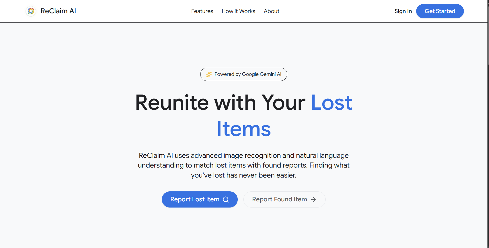

### Authentication

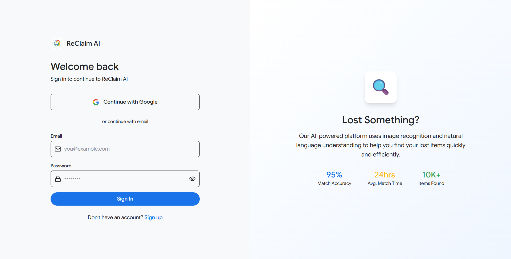

### Admin Dashboard

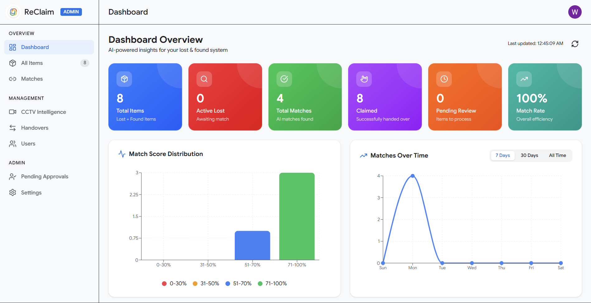

### Report Page

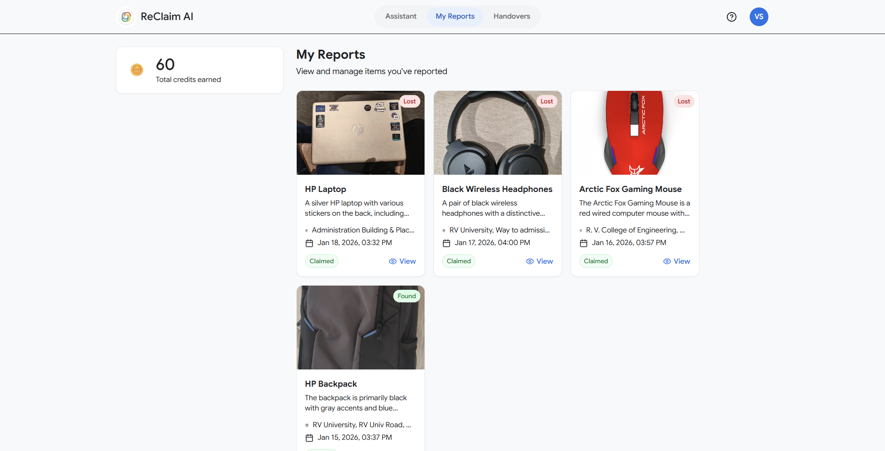

### Report Found Component

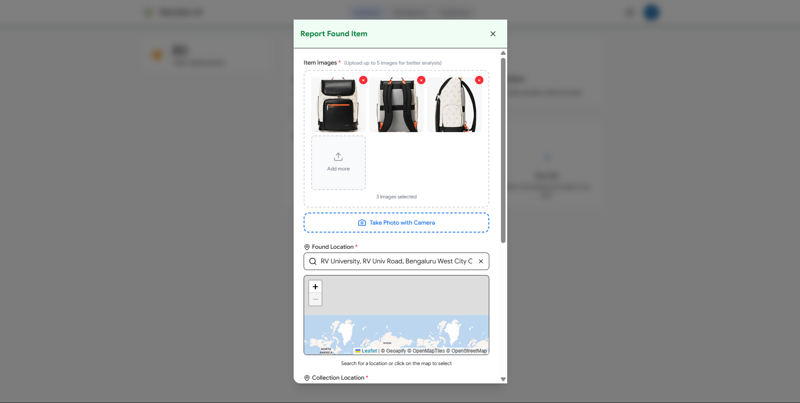

### Pending Approval Page

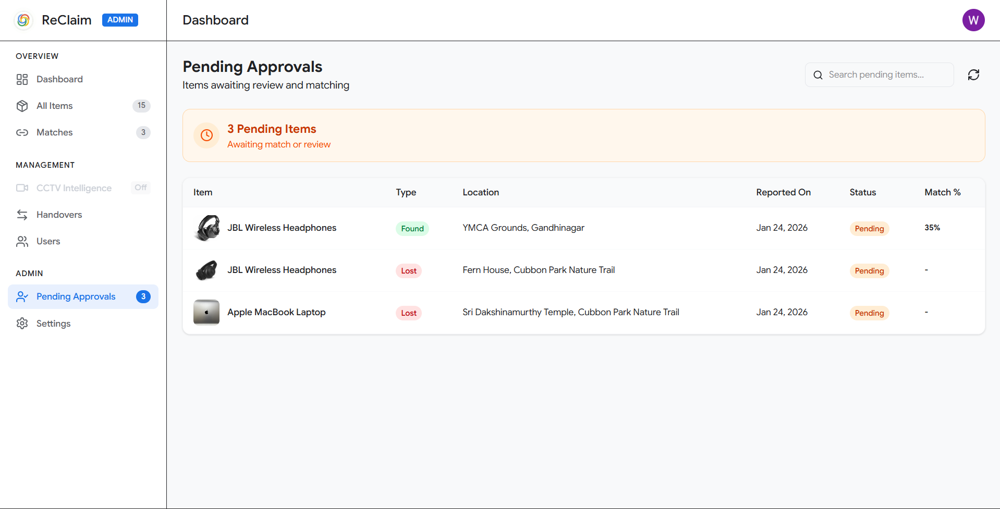

### Handover Page (Admin)

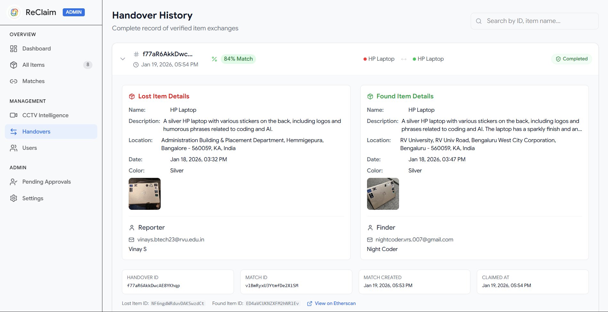

### Handover Page (User)

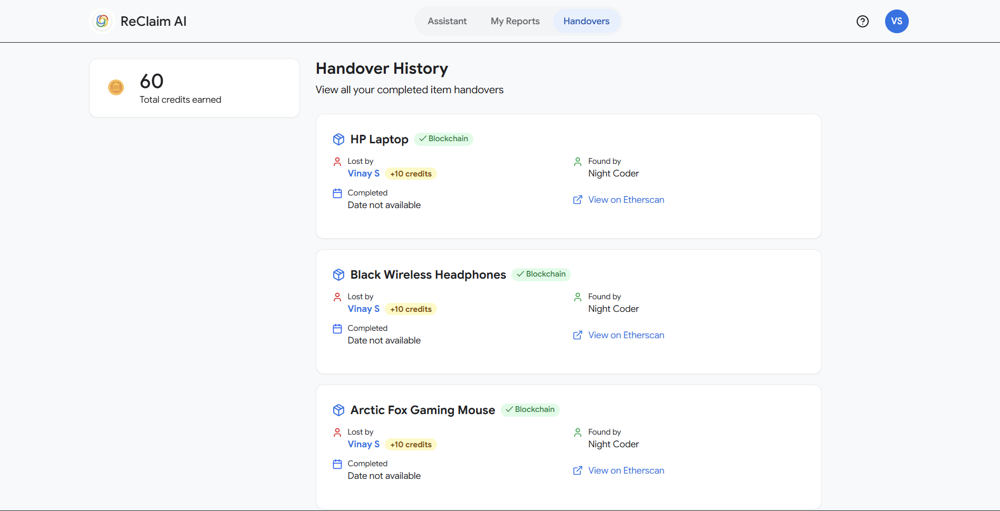

### Profile Page

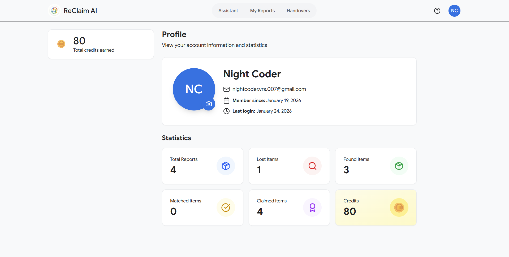

### Settings Page

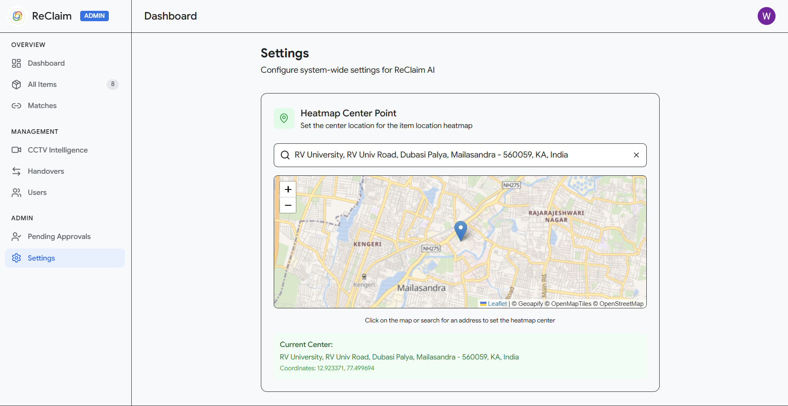

### CCTV Intelligence

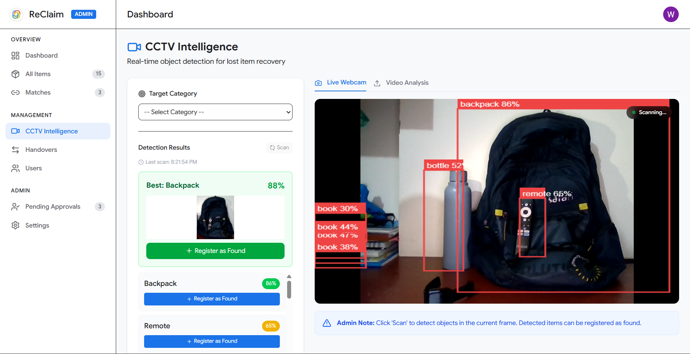

## Contributing

1. Fork the repository
2. Create your feature branch (`git checkout -b feature/amazing-feature`)
3. Commit your changes (`git commit -m 'Add amazing feature'`)
4. Push to the branch (`git push origin feature/amazing-feature`)
5. Open a Pull Request

## License

**All Rights Reserved** © 2026 ReClaim AI Team

This project and its source code are proprietary. Unauthorized copying, modification, distribution, or use of this software is strictly prohibited without explicit written permission from the authors.

## Acknowledgments

- GDG TechSprint Hackathon 2026-27
- Uses Groq's fast inference for AI features
- Maps powered by Geoapify & Leaflet
