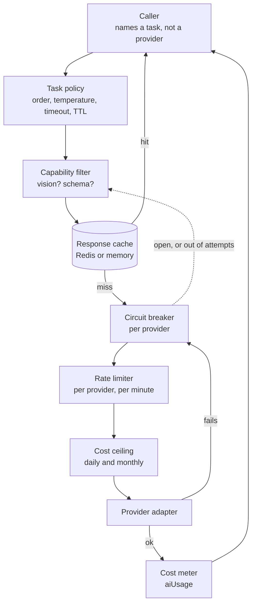

# AI providers and the router

How a model call is made, who makes it, what it costs, and what happens when a
provider is down. Built in phase 21. The decision behind it is
[ADR 010](../adr/0010-provider-agnostic-ai.md).

## The problem it solves

Every model call used to go through one function with a switch statement in it
and a fallback chain written into the code:

```
groq fails -> try gemini.  gemini fails -> try grok.  grok fails -> try groq.
```

That shape has no capability routing (a text-only model was sent images and
failed at the API), no breaker (a provider that was down cost fifteen seconds
of timeout on every request, forever), no cache (the same pair was re-scored on
every matching run), no cost meter, no rate limit of our own, and no way to
constrain a reply to a schema. Adding a fourth provider meant editing the
switch, the fallback chain, and a type union in three files.

## The path a call takes



The loop back into the filter is the fallback: the next candidate in policy
order, not a hardcoded partner.

## What the router does that the switch did not

| Concern            | Behaviour                                                                                                                       |
| ------------------ | ------------------------------------------------------------------------------------------------------------------------------- |
| Capability routing | A request with images only reaches a provider that declares vision; a schema request only reaches one that can constrain output |
| Policy             | Per task, not per application: order, temperature, token budget, timeout, cache TTL, attempts                                   |
| Circuit breaking   | Three consecutive failures opens a provider for 30s, then one probe decides                                                     |
| Rate limiting      | A per-provider budget per minute, shared across processes through Redis when it is configured                                   |
| Retry              | Exponential backoff with jitter, and only on a retryable status. A 400 is never retried                                         |
| Timeout            | Every attempt carries an abort signal, and every call a total deadline across providers                                         |
| Caching            | Keyed on provider, model, messages, parameters, schema name and a hash of every image                                           |
| Cost metering      | Every call priced from the provider's own token counts into `aiUsage`, with daily and monthly ceilings                          |
| Structured output  | One interface, translated per provider, and validated here with one repair attempt                                              |
| Observability      | One log line per call: task, provider, model, cache hit, attempt, latency, tokens, cost. The trace id is already on it          |

## Tasks

A task is the unit that has requirements. The old single `aiProvider` setting
decided image analysis and pair scoring together, which is why one of them was
always configured wrong.

| Task             | Used by                            | Cached | Deadline | Notes                                            |
| ---------------- | ---------------------------------- | ------ | -------- | ------------------------------------------------ |
| `item.analyze`   | Report and add-item image analysis | No     | 35s      | Needs vision. A user is waiting on it            |
| `item.enhance`   | Description enhancement for Lost   | No     | 35s      | Text only, falls back to what the user typed     |
| `match.semantic` | The matching pipeline              | 1 hour | 90s      | The high-volume one, and the reason cache exists |
| `cctv.describe`  | Describing a detected object       | No     | 35s      | Needs vision                                     |
| `cctv.verify`    | Detection against a lost report    | No     | 35s      | Text only                                        |

The deadline is per call, across every provider and attempt. A per-attempt
timeout bounds nothing useful once the fallback list is as long as the
registry: six providers at fifteen seconds each is a minute and a half on a
form the user is watching.

The admin `aiProvider` setting still chooses the order of providers, which is
what it has always meant. `groq_only` still means only Groq; `groq_with_fallback`
now means every other configured provider, cheapest first, rather than the one
hardcoded partner it used to mean. The per-task policy an admin can edit is
phase 32's work.

The primary that setting names is never demoted. Vision is a hard filter,
because a text-only model handed an image returns a 400 no retry can fix, but a
schema is only a preference: filtering on it would have sent every structured
call to OpenAI or Anthropic, the only two providers here that constrain output,
at roughly fifteen times the price, while the admin screen still said "Primary:
Groq". So the primary goes first and schema-capable fallbacks are tried ahead of
the other fallbacks.

## Providers

| Provider    | Adapter           | Default model        | Vision | Schema-constrained | Configured by       |
| ----------- | ----------------- | -------------------- | ------ | ------------------ | ------------------- |
| `groq`      | OpenAI-compatible | `qwen/qwen3.6-27b`   | Yes    | No, JSON mode only | `GROQ_API_KEY`      |
| `gemini`    | Gemini            | `gemini-3.8-flash`   | Yes    | No, JSON mode only | `GEMINI_API_KEY`    |
| `grok`      | OpenAI-compatible | `grok-2-vision-1212` | Yes    | No, JSON mode only | `GROK_API_KEY`      |
| `openai`    | OpenAI-compatible | `gpt-5-mini`         | Yes    | Yes                | `OPENAI_API_KEY`    |
| `anthropic` | Anthropic SDK     | `claude-haiku-4-5`   | Yes    | Yes                | `ANTHROPIC_API_KEY` |
| `local`     | OpenAI-compatible | `llama3.2`           | No     | No                 | `LOCAL_LLM_URL`     |

Vision in that table is a property of the model, not of the provider, and Groq
is the only one here whose catalogue mixes both: the same key reaches
multimodal Qwen and text-only `gpt-oss`. So the groq entry reads the capability
off the configured model, and a model the registry does not recognise is
assumed text-only. Point `GROQ_MODEL` at a text model and image analysis routes
around Groq instead of collecting a 400 from it.

A provider with no key is not registered, so "configured" and "available" are
the same question. Adding one is an entry in `providers/registry.ts`, plus an
adapter file only if it speaks a wire format none of the others do. No caller
changes, which is the test ADR 010 set.

`local` is any OpenAI-compatible endpoint on the machine, such as Ollama:

```bash
ollama serve
ollama pull llama3.2
# server/.env
LOCAL_LLM_URL=http://localhost:11434/v1/chat/completions
LOCAL_LLM_MODEL=llama3.2
```

That is what lets someone with no keys at all run the matching pipeline end to
end, and it costs nothing to leave configured as the last fallback.

### Two model identifiers worth knowing about

Groq deprecated `meta-llama/llama-4-scout-17b-16e-instruct`, which this
application used until this phase, on 2026-06-17 for free and developer tiers,
with a shutdown on 2026-07-17. Groq names two migration paths,
`openai/gpt-oss-120b` and `qwen/qwen3.6-27b`. Only the second takes images, and
this application sends images on `item.analyze` and `cctv.describe`, so that is
the default: the faster text model would have left both features quietly
returning their fallbacks. Every provider's model is overridable (`GROQ_MODEL`,
`GEMINI_MODEL`, `GROK_MODEL`, `OPENAI_MODEL`, `ANTHROPIC_MODEL`) because
identifiers move faster than deployments do.

The OpenAI entry carries one more piece of model-shaped knowledge: the GPT-5
family renamed `max_tokens` to `max_completion_tokens` and accepts only its
default temperature, so the registry selects the field name and drops the
temperature for those models. Sending either the old way is a 400 on every
request.

## Structured output

A `StructuredSpec` carries two shapes of the same schema: a JSON Schema, which
is what a provider constrains against, and a zod schema, which is what
validates the reply. Providers that can constrain output are given the schema;
the rest are told what shape to return, in the prompt. Either way the reply is
validated here, and a failure gets one repair attempt naming what was wrong
before the call fails.

Asking is not constraining, which is why the capability is declared per
provider and the validation is not optional.

## Cost

Every call is priced from the provider's own token counts and added to a daily
and a monthly document in `aiUsage`. Prices are per million tokens and carry
the date they were checked; `AI_DAILY_BUDGET_USD` and `AI_MONTHLY_BUDGET_USD`
turn the meter into a ceiling, and both default to zero, which means no ceiling
and is the behaviour before this phase.

A ceiling refuses the call outright rather than falling through to the next
provider: a budget is a decision, and shopping around would spend money the
deployment just said it would not spend.

## Where the code is

| File                                                  | What it is                                                                      |
| ----------------------------------------------------- | ------------------------------------------------------------------------------- |
| `platform/ai/ports/chat.port.ts`                      | `ChatProvider`, and what a caller may ask for                                   |
| `platform/ai/ports/embedding.port.ts`                 | `EmbeddingProvider`, `ImageEmbedder`, `VisionProvider`. Phase 22 fills these in |
| `platform/ai/providers/openai-compatible.provider.ts` | Groq, Grok, OpenAI and the local runtime                                        |
| `platform/ai/providers/gemini.provider.ts`            | Gemini's own request shape                                                      |
| `platform/ai/providers/anthropic.provider.ts`         | Claude, through the official SDK                                                |
| `platform/ai/providers/registry.ts`                   | Every provider, its model, its capabilities and its price                       |
| `platform/ai/router/policy.ts`                        | Tasks, their policies, and the admin setting mapped onto an order               |
| `platform/ai/router/router.ts`                        | The call path above                                                             |
| `platform/ai/router/breaker.ts`                       | Per-provider circuit breaker                                                    |
| `platform/ai/router/cache.ts`                         | Response cache, Redis or memory                                                 |
| `platform/ai/router/rate-limit.ts`                    | Per-provider request budget                                                     |
| `platform/ai/router/cost.ts`                          | Pricing, the `aiUsage` documents, and the ceiling                               |
| `platform/ai/structured.ts`                           | The spec, the instruction, and reading JSON out of a chatty reply               |
| `platform/redis/shared.ts`                            | The connection the cache and the rate budget share, separate from the queue's   |

## Operating it

- **What is this costing?** `aiUsage/{YYYY-MM-DD}` and `aiUsage/{YYYY-MM}`, with
  `byProvider` and `byTask` breakdowns on each.
- **Why is a provider not being used?** Its circuit may be open: the log line
  is `Skipping provider, circuit is open`. Otherwise it has no key, or the task
  needed a capability it does not declare.
- **Why did a call fail entirely?** `Every provider failed` names the ones that
  were tried, and each attempt logged its own reason before it.
- **Turning a provider off** is removing its key. There is no other switch, and
  the admin setting only decides the order.
- **Why is a task slower than its timeout?** It is not: the timeout is per
  attempt and the deadline is per call. `Deadline reached before an answer`
  means the call ran out of budget with providers still untried.
