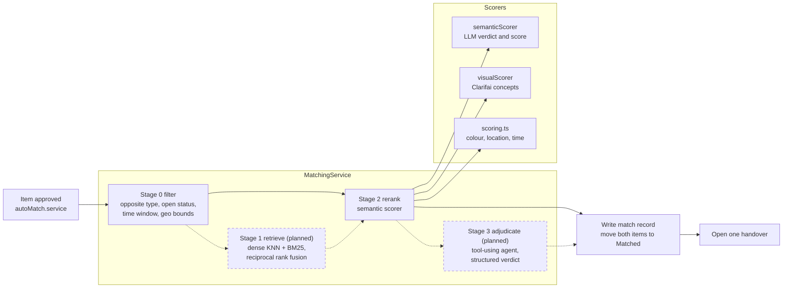
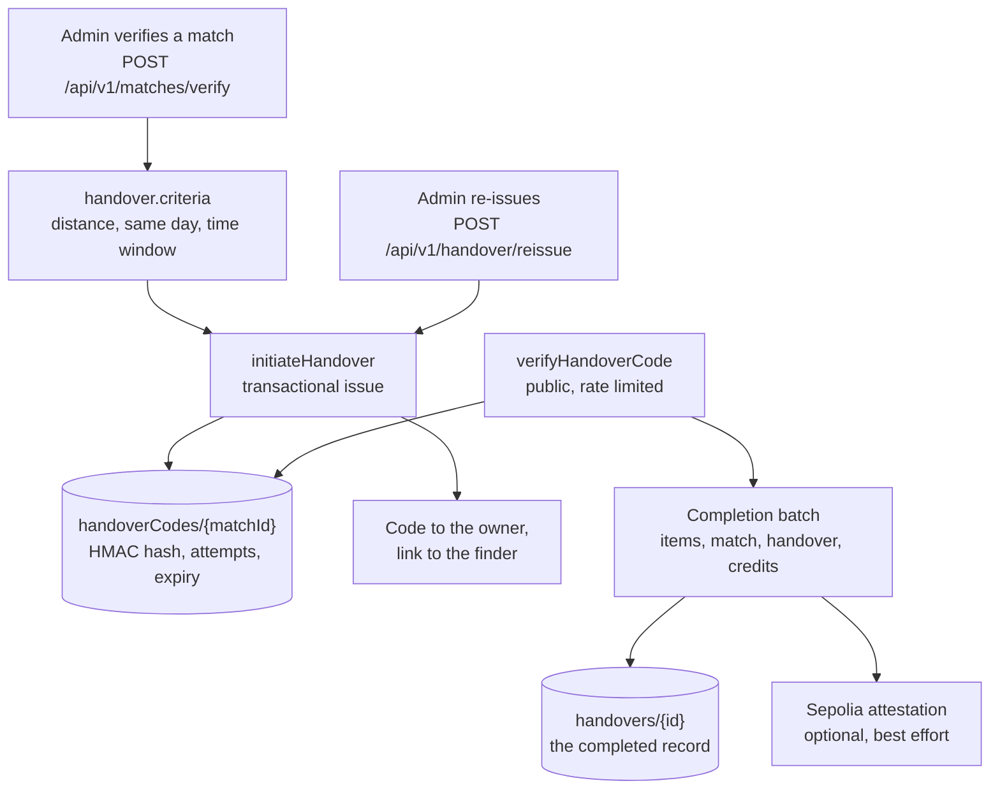
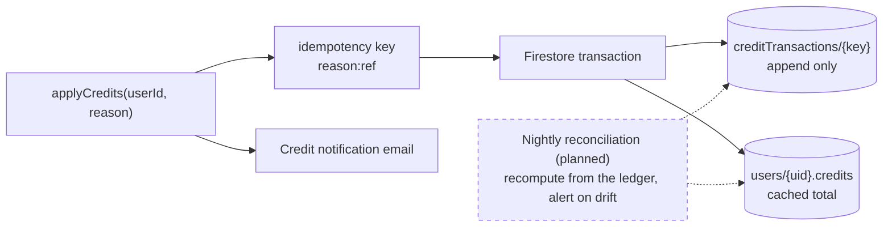

# C4 level 3, components

The insides of the three modules where the design work is: matching, handover
and the ledger. Also the module boundaries the whole server is meant to grow
into.

## Module boundaries

Each module owns its repositories and exposes a service interface. A
cross-module call goes through that interface and never reaches into another
module's repository, so a later split into separate services stays possible.

```
server/src/modules/
  identity/      users, roles, sessions, blocking
  catalog/       items, images, tags, moderation
  matching/      filters, retrieval, rerank, adjudication, eval
  handover/      state machine, codes, events, saga, revert
  ledger/        credits, entries, policies, reconciliation
  inventory/     sites, units, custody, retention, stats
  messaging/     conversations, moderation, safety
  notification/  email, push, in-app, templates, outbox consumers
  intelligence/  provider registry, router, embeddings, cache, cost
  platform/      config, logging, tracing, errors, jobs, outbox
```

Today the server is layered but not yet modular: `routes/`, `controllers/`,
`services/`, `repositories/`, `schemas/` each hold every domain. The layering
came first because it is what made the repositories injectable and the services
testable. The move to `modules/` is the next step and is not scheduled to a
phase yet; the honest position is that the boundary above is a target, and the
current directory layout is documented in
[server-source-structure.md](../server-source-structure.md).

What already holds today is the important half of the rule: nothing outside
`repositories/` touches a Firestore collection reference.

## Matching



Today stage 0 is a Firestore query for pending items of the opposite type and
stage 2 scores every survivor. There is no retrieval stage, so the number of
LLM calls is the number of candidates. The four-stage target and the arithmetic
behind it are in [requirements and capacity](nfr-and-capacity.md) and
[ADR 002](../adr/0002-retrieve-then-rerank.md).

What is already true and worth keeping:

- Scoring lives entirely in the pipeline. `autoMatch.service.ts` is the only
  entry point, and it does the create-path work: persisting match records,
  moving item status, and opening exactly one handover per run.
- The normalization divides by the weights that actually produced a value, so
  an unavailable signal is excluded rather than silently scoring zero.
- A match needs both a semantic verdict and at least 65 of the 100 available
  weight. The threshold is not a single number scraped from a model.

## Handover



The code is hashed with HMAC-SHA256 and a server-side pepper, with the
algorithm version stored on the record so old codes still verify after a
rotation. Attempts are counted transactionally and cap the session, not the
user's account.

The completion batch is one Firestore batch across four collections, which is
why it lives in `HandoverRepository` rather than being split per collection.
That is as close to atomic as the current design gets; the outbox and saga that
replace it are [ADR 006](../adr/0006-outbox-and-saga.md) and phase 26.

## Ledger



The ledger and the cached balance move in the same transaction, and where an
award carries an idempotency key that key is the ledger document id, so a
replay collides on the same document inside the transaction instead of racing
a read-then-write check. Deliberate repeats, an admin adjustment or a
false-claim penalty, carry no key and get an auto-generated id, because the
same admin charging the same user twice is two real events. Reversing entries,
policy as data and the nightly reconciliation are phase 28 and
[ADR 007](../adr/0007-double-entry-ledger.md).
