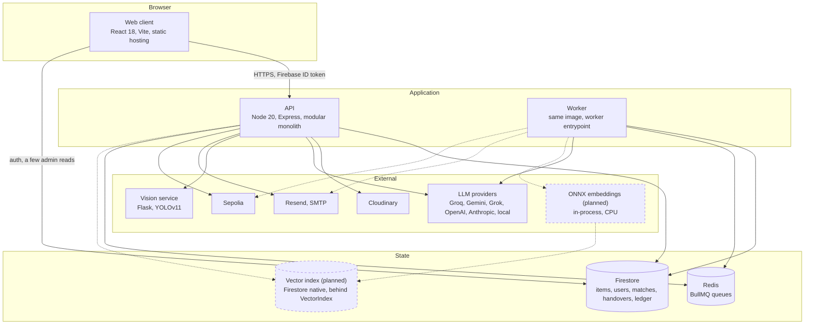
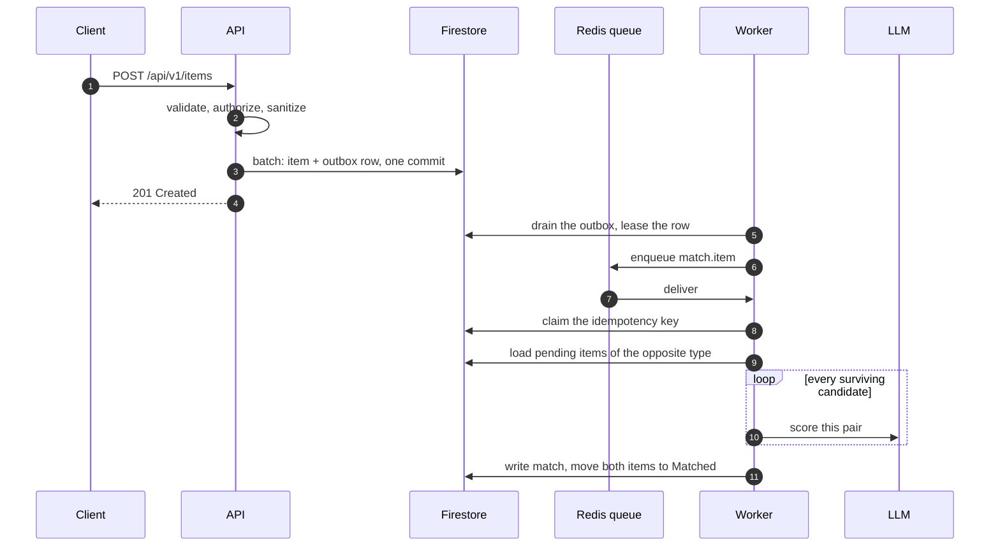

# C4 level 2, containers

The deployable and runnable pieces. Dashed boxes marked `(planned)` do not
exist yet; the phase that introduces each one is named below the diagram.

## What each container is for

| Container       | Runtime                                                    | Responsibility                                                                                                                          | Status                                                                                                     |
| --------------- | ---------------------------------------------------------- | --------------------------------------------------------------------------------------------------------------------------------------- | ---------------------------------------------------------------------------------------------------------- |
| Web client      | React 18, Vite, static hosting                             | UI and the PWA shell. Every write goes through the API; the browser holds no business rules                                             | Built                                                                                                      |
| API             | Node 20, Express, modular monolith                         | HTTP, authentication, validation, orchestration. Email and chain writes still run here; matching does not                               | Built                                                                                                      |
| Worker          | Node 20, same image, worker entrypoint                     | Drains the outbox and runs jobs. Matching today; embeddings, email and chain writes as later phases move them                           | Built, phase 20                                                                                            |
| Queue and cache | Redis, managed                                             | BullMQ queues. Rate-limit buckets and the LLM cache still live in the API process                                                       | Built, phase 20. Queues only                                                                               |
| Primary store   | Firestore                                                  | Every document. Also the transaction boundary                                                                                           | Built                                                                                                      |
| Vector index    | Firestore native vector search behind a `VectorIndex` port | Dense retrieval over item embeddings                                                                                                    | Planned, phase 23. See [ADR 003](../adr/0003-vector-index.md)                                              |
| Object store    | Cloudinary                                                 | Item images and derived thumbnails                                                                                                      | Built                                                                                                      |
| Inference       | ONNX Runtime in-process                                    | Text and image embeddings on CPU                                                                                                        | Planned, phase 22. See [ADR 004](../adr/0004-cpu-onnx-embeddings.md)                                       |
| Vision service  | Python Flask and YOLOv11                                   | CCTV object detection only. Token-authenticated, refuses every request without `YOLO_SERVICE_TOKEN`                                     | Built                                                                                                      |
| LLM gateway     | Internal module, multi-provider                            | Image analysis, pair scoring and CCTV description. Capability routing, breaker, cache, cost meter and structured output behind one port | Built, phase 21. See [ai-providers.md](ai-providers.md) and [ADR 010](../adr/0010-provider-agnostic-ai.md) |
| Chain           | Ethers and Sepolia                                         | Handover attestation. Optional, best effort                                                                                             | Built, off by default                                                                                      |

The API and the worker ship from the same image with different entrypoints, so
their dependencies and their code cannot drift apart.

## The request path today

A report is filed, the item and the intent to match it commit together, and
nothing else happens inside the request:

The commit is what makes it reliable: the item and the intent to match it land
together, so matching cannot be silently skipped, and a matching failure cannot
fail a report that is already saved. Each job carries its own retry policy and
dead-letters when it gives up. See
[Jobs, the outbox, and tracing](jobs-and-outbox.md).

The loop that used to grow with the corpus is gone. Retrieval narrows the
field before anything expensive runs (phase 23, on the embeddings phase 22 put
behind it), and the batched reranker scores what is left in one call rather
than one per candidate (phase 24, made the only semantic scorer in phase 25).
A report costs two model calls, plus one bounded agent run when a pair lands in
the uncertainty band.

## Where the rest of the work still runs

Moving the work is per phase, not all at once. Email, the chain write and the
CCTV proxy still run in the API process; phases 26 to 29 move them onto the
same outbox as they rewrite what they do.

## Cross-cutting concerns

| Concern         | Where it lives today                                                                                                                                                                  |
| --------------- | ------------------------------------------------------------------------------------------------------------------------------------------------------------------------------------- |
| Authentication  | `auth.middleware.ts`. Verifies the Firebase ID token, then resolves the role from Firestore, never from the token or the body                                                         |
| Authorization   | `role.middleware.ts`. `requireAdmin`, `requireActiveUser`, `requireOwnership`                                                                                                         |
| Validation      | `validation.middleware.ts` with zod schemas in `schemas/`. Every mutating route validates and the parsed value replaces the raw one                                                   |
| Errors          | `errorHandler.middleware.ts`. `AppError` carries the status and optional details; a deliberate 4xx keeps its message, a 5xx is sanitized in production                                |
| Rate limiting   | `rateLimit.middleware.ts`. Per-surface budgets: the API as a whole, AI routes, item creation, handover verify and status, credentials                                                 |
| Logging         | `utils/logger.ts`. The only logging entry point. Redacts identifiers, drops stack traces in production                                                                                |
| Correlation ids | `platform/tracing/context.ts`. W3C `traceparent` joined from the caller, held in an `AsyncLocalStorage`, stamped on every log line and carried through the outbox into the worker     |
| Background work | `platform/jobs` and `platform/outbox`. Events commit with the write that raised them, a worker drains and runs them. See [jobs and the outbox](jobs-and-outbox.md)                    |
| Model calls     | `platform/ai`. A caller names a task, never a provider; the router handles capability, order, breaker, retry, timeout, cache, cost and schema. See [ai-providers.md](ai-providers.md) |
