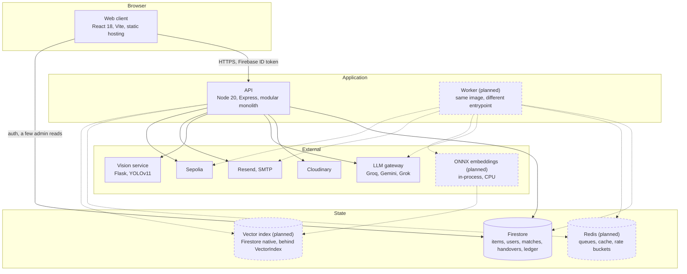
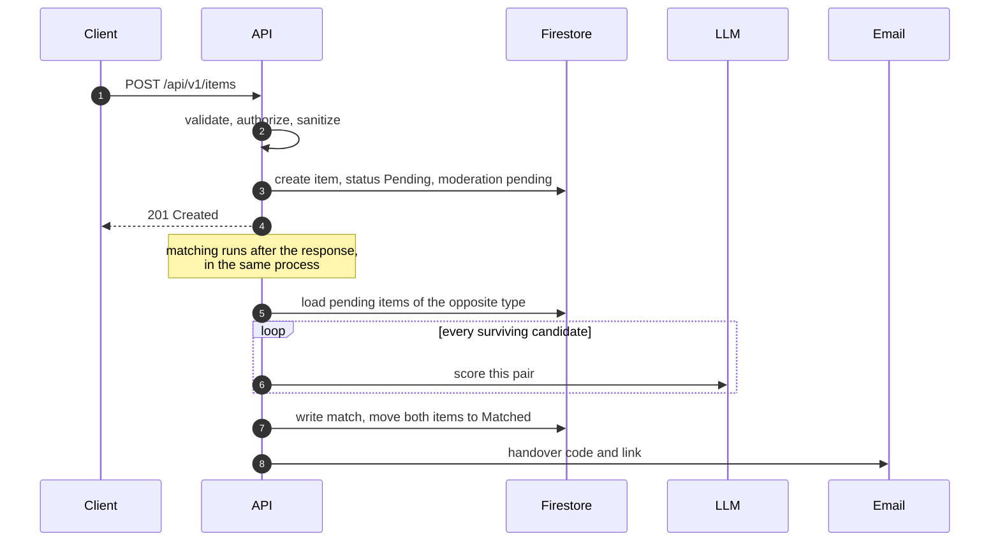
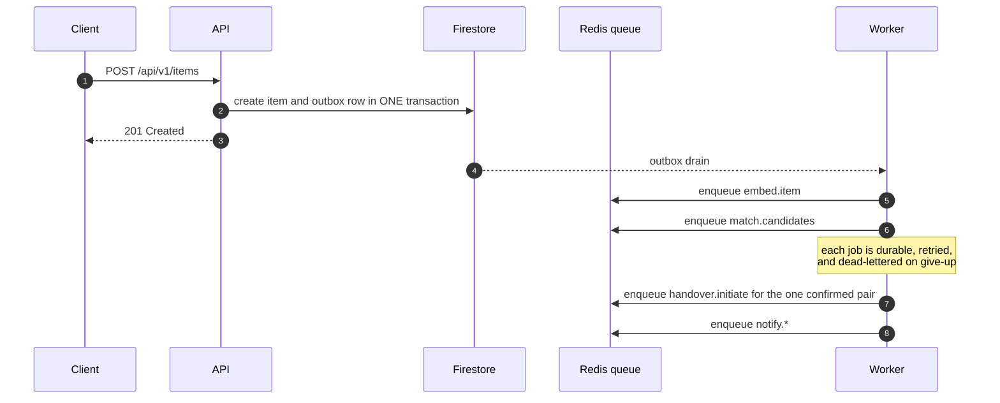

# C4 level 2, containers

The deployable and runnable pieces. Dashed boxes marked `(planned)` do not
exist yet; the phase that introduces each one is named below the diagram.

## What each container is for

| Container       | Runtime                                                    | Responsibility                                                                                           | Status                                                                                 |
| --------------- | ---------------------------------------------------------- | -------------------------------------------------------------------------------------------------------- | -------------------------------------------------------------------------------------- |
| Web client      | React 18, Vite, static hosting                             | UI and the PWA shell. Every write goes through the API; the browser holds no business rules              | Built                                                                                  |
| API             | Node 20, Express, modular monolith                         | HTTP, authentication, validation, orchestration. Matching, email and chain writes currently run here too | Built                                                                                  |
| Worker          | Node 20, same image, different entrypoint                  | Matching, embeddings, email, chain writes, outbox drain. Nothing that blocks a request                   | Planned, phase 20                                                                      |
| Queue and cache | Redis, managed                                             | BullMQ queues, rate-limit buckets, LLM and embedding cache                                               | Planned, phase 20                                                                      |
| Primary store   | Firestore                                                  | Every document. Also the transaction boundary                                                            | Built                                                                                  |
| Vector index    | Firestore native vector search behind a `VectorIndex` port | Dense retrieval over item embeddings                                                                     | Planned, phase 23. See [ADR 003](../adr/0003-vector-index.md)                          |
| Object store    | Cloudinary                                                 | Item images and derived thumbnails                                                                       | Built                                                                                  |
| Inference       | ONNX Runtime in-process                                    | Text and image embeddings on CPU                                                                         | Planned, phase 22. See [ADR 004](../adr/0004-cpu-onnx-embeddings.md)                   |
| Vision service  | Python Flask and YOLOv11                                   | CCTV object detection only. Token-authenticated, refuses every request without `YOLO_SERVICE_TOKEN`      | Built                                                                                  |
| LLM gateway     | Internal module, multi-provider                            | Rerank, adjudication, enrichment. Today a switch statement with a fallback chain                         | Partly built. Phase 21 replaces it. See [ADR 010](../adr/0010-provider-agnostic-ai.md) |
| Chain           | Ethers and Sepolia                                         | Handover attestation. Optional, best effort                                                              | Built, off by default                                                                  |

The API and the worker ship from the same image with different entrypoints, so
their dependencies and their code cannot drift apart.

## The request path today

A report is filed and everything else happens before the response returns:

Two properties of that path are the reason for most of Track B. The LLM is
called once per candidate, so cost and latency grow with the corpus. And the
work after the response has no durability: if the process restarts mid-way, the
report exists and nothing else does, with no record that matching was owed.

## The request path after phase 20

The transaction is what makes it reliable: the item and the intent to match it
are committed together, so matching cannot be silently skipped, and a matching
failure cannot fail a report that is already saved.

## Cross-cutting concerns

| Concern         | Where it lives today                                                                                                                                   |
| --------------- | ------------------------------------------------------------------------------------------------------------------------------------------------------ |
| Authentication  | `auth.middleware.ts`. Verifies the Firebase ID token, then resolves the role from Firestore, never from the token or the body                          |
| Authorization   | `role.middleware.ts`. `requireAdmin`, `requireActiveUser`, `requireOwnership`                                                                          |
| Validation      | `validation.middleware.ts` with zod schemas in `schemas/`. Every mutating route validates and the parsed value replaces the raw one                    |
| Errors          | `errorHandler.middleware.ts`. `AppError` carries the status and optional details; a deliberate 4xx keeps its message, a 5xx is sanitized in production |
| Rate limiting   | `rateLimit.middleware.ts`. Per-surface budgets: the API as a whole, AI routes, item creation, handover verify and status, credentials                  |
| Logging         | `utils/logger.ts`. The only logging entry point. Redacts identifiers, drops stack traces in production                                                 |
| Correlation ids | Not yet. Planned with the worker in phase 20                                                                                                           |
