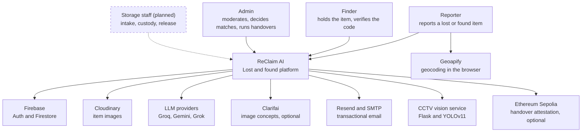

# C4 level 1, system context

Who uses ReClaim AI and what it depends on. One box for the whole system: the
insides are [level 2](c4-container.md).

## The people

| Actor         | What they do                                                                                                                                     | How they are authenticated                                                                                                                                       |
| ------------- | ------------------------------------------------------------------------------------------------------------------------------------------------ | ---------------------------------------------------------------------------------------------------------------------------------------------------------------- |
| Reporter      | Reports an item as lost or found, with photos and a location, and watches their own reports                                                      | Firebase Auth, Google or email and password                                                                                                                      |
| Finder        | The other half of a match. Verifies the handover code from a link in an email                                                                    | Not authenticated. They hold a link and a six-digit code, which is deliberate: requiring an account to return someone's property is a barrier in the wrong place |
| Admin         | Approves or rejects reports, decides proposed matches, opens and re-issues handovers, manages users, credits and settings, works the CCTV screen | Firebase Auth plus `role: 'admin'` resolved from Firestore on every request                                                                                      |
| Storage staff | Intake, move and release physical items against a custody record. **Planned**, phase 30                                                          | Firebase Auth plus a site-scoped role                                                                                                                            |

The finder being unauthenticated is the reason `POST /api/handover/verify` and
`GET /api/handover/status/:matchId` are public, and the reason both carry their
own rate limiter.

## The dependencies

| System              | Used for                                                                      | What happens when it is down                                                                                                                     |
| ------------------- | ----------------------------------------------------------------------------- | ------------------------------------------------------------------------------------------------------------------------------------------------ |
| Firebase Auth       | Identity for the browser and token verification on the server                 | Nobody can sign in. Existing tokens verify until they expire                                                                                     |
| Firestore           | Every document. The only primary store                                        | The API returns 500 on anything that reads or writes. No local cache                                                                             |
| Cloudinary          | Item image upload and delivery                                                | Reports can be filed without images. An upload failure fails the report                                                                          |
| LLM providers       | Semantic scoring in matching, description enhancement, CCTV image description | Matching falls back to the next provider, then scores nothing semantically and the pair does not reach the threshold. Reports still save         |
| Clarifai            | Image concept overlap as a similarity signal. Optional                        | The image signal scores zero and is excluded from the denominator                                                                                |
| Resend, SMTP        | Handover codes, login notices, credit notices                                 | Resend failure falls back to SMTP. Both failing loses the message: there is no outbox yet (phase 20)                                             |
| CCTV vision service | Object detection on uploaded footage and the live tab                         | The CCTV screen returns 502. Nothing else is affected                                                                                            |
| Sepolia             | An attestation of a completed handover                                        | Off by default. When enabled a failure is logged and the handover still completes                                                                |
| Geoapify            | Geocoding and reverse geocoding in the location picker                        | The user types a location instead of picking one, and the item has no coordinates, which weakens matching and blocks the handover distance check |

## Trust boundaries

Everything in the browser is untrusted, including the values it sends for its
own role, credits and item status. The server resolves the caller's role from
Firestore rather than from the token claims or the body, and Firestore rules
close every collection the browser no longer needs to read directly.

Item text (name, description, tags) is attacker-controlled and reaches an LLM
prompt. That is an open defect, AI-02, scheduled for phase 25.
