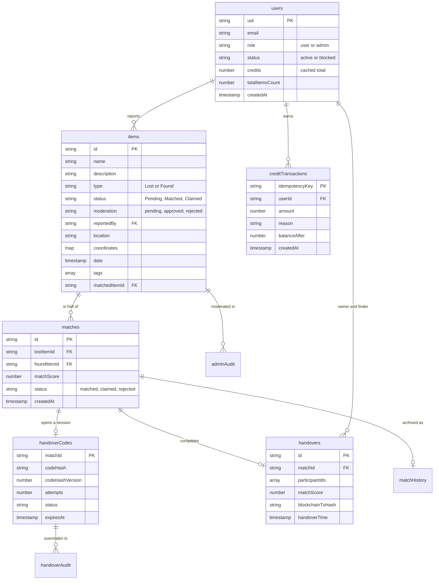

# Data model

Every collection Firestore holds, what is in it, who may read it, and which
index exists for which query. Field names are the real ones.

## Entities

## Collections

| Collection           | Document id              | Holds                                                                                                               | Browser may                                                                    |
| -------------------- | ------------------------ | ------------------------------------------------------------------------------------------------------------------- | ------------------------------------------------------------------------------ |
| `users`              | Firebase uid             | Profile, role, status, cached credit balance, report counters                                                       | Read its own document, and an admin any document. No listing, no writes at all |
| `items`              | auto                     | The report: text, type, status, moderation, location, coordinates, images, tags                                     | Nothing. Closed entirely; every screen reads `GET /api/v1/items`               |
| `matches`            | auto                     | An open proposed or verified pair, with the per-signal scores                                                       | Admin read                                                                     |
| `matchHistory`       | the match id             | A match archived on completion, so dashboards keep counting it                                                      | Admin read                                                                     |
| `handoverCodes`      | the match id             | The hashed code, attempt count, expiry, override markers                                                            | Nothing, either direction                                                      |
| `handovers`          | auto                     | The completed handover: both item snapshots, both people, score, chain hash, `participantIds`                       | Admin read                                                                     |
| `handoverAudit`      | auto                     | Criteria overrides and code re-issues, with the admin and their reason                                              | Nothing                                                                        |
| `adminAudit`         | auto                     | Moderation decisions and match verdicts                                                                             | Nothing                                                                        |
| `creditTransactions` | idempotency key, or auto | The ledger: one row per credit movement, with the balance after it                                                  | Admin read                                                                     |
| `settings`           | `system`, `analytics`    | Feature flags, AI provider, thresholds; the visitor counter                                                         | Any signed-in user reads `system`, admin reads `analytics`. No writes          |
| `collectionPoints`   | auto                     | Named places a found item can be handed in                                                                          | Nothing                                                                        |
| `credits`            | uid                      | **Retired.** The old per-user balance document. Admin-readable until the reconciliation is verified, then droppable | Admin read                                                                     |

The rule of thumb the security rules follow: the browser may read what belongs
to it, and may write nothing that decides authority, money, or item state.
Everything else goes through the API, where the request is authenticated,
validated, rate limited and logged. The server holds a service account and
bypasses every rule, which is why the rules describe the browser only.

## Indexes and the queries they exist for

`firestore.indexes.json` is the source. Every entry below is there because a
real query needs it; a composite index with no query is a cost with no benefit.

| Index                                                        | Query it serves                                                |
| ------------------------------------------------------------ | -------------------------------------------------------------- |
| `items` type, createdAt desc                                 | The browse list filtered to Lost or Found                      |
| `items` status, createdAt desc                               | The admin queue filtered by status                             |
| `items` reportedBy, createdAt desc                           | My reports                                                     |
| `items` type + status, createdAt desc                        | Matching stage 0: pending items of the opposite type           |
| `items` type + reportedBy, createdAt desc                    | My reports, one type                                           |
| `items` status + reportedBy, createdAt desc                  | My reports, one status                                         |
| `items` type + status + reportedBy, createdAt desc           | The fully filtered list, which is what the admin screen builds |
| `creditTransactions` userId, createdAt desc                  | The ledger behind one balance                                  |
| `handovers` participantIds array-contains, handoverTime desc | One person's completed handovers, in one query                 |
| `handovers` status, handoverTime desc                        | The admin history                                              |
| `matches` lostItemId, createdAt desc                         | Find the open match for an item                                |
| `matches` foundItemId, createdAt desc                        | The same from the other side                                   |

Two notes a reader will otherwise trip on:

- `moderation` is deliberately **not** in any composite index. It is filtered
  in memory, because a document that predates review has no such field, and an
  equality filter would have hidden the entire existing corpus until the
  migration ran. A fourth filtered field on the item list would also have
  needed roughly eight more composite indexes. The cost is that a page of the
  browse list can come back shorter than its limit.
- `participantIds` is a denormalization. It exists so one person's handovers
  are an `array-contains` query rather than a scan of every handover comparing
  four nested fields. Records written before the backfill have no such field,
  so the server keeps a filtered fallback and a settings flag says when the
  migration has run.

## Access patterns

| Pattern                 | How it is served                                                                                                                    |
| ----------------------- | ----------------------------------------------------------------------------------------------------------------------------------- |
| Browse items            | `GET /api/v1/items` with a cursor. Not offset: an offset walk re-reads every skipped document                                       |
| One person's reports    | Indexed on `reportedBy`, ownership enforced server side                                                                             |
| Admin dashboard         | `GET /api/v1/stats/dashboard`. Aggregation queries and field masks, one request per refresh, never a collection read in the browser |
| Matching candidates     | `type + status` index, then filtered in memory for moderation                                                                       |
| One person's handovers  | `array-contains` on `participantIds` once the backfill has run, filtered scan before that                                           |
| Credit balance          | Read the cached total on `users/{uid}`. The ledger is only read for history                                                         |
| Handover session lookup | The document id is the match id, so it is a direct get, not a query                                                                 |

## Conventions

- **Timestamps.** Documents hold Firestore `Timestamp`s, and the API
  serializes them. The shared types carry the timestamp class as a generic
  parameter, so one interface describes an Admin SDK document, a Web SDK
  document and a JSON response. That is what stopped the two packages
  declaring their own drifting copies.
- **Ids as keys.** Where a document has exactly one natural key, it is the id:
  `handoverCodes/{matchId}`, `matchHistory/{matchId}`, a keyed
  `creditTransactions/{idempotencyKey}`. That turns a uniqueness constraint
  into a property of the store rather than a check in application code.
- **Soft state, hard history.** Status fields move; audit collections only ever
  grow. Nothing in `adminAudit`, `handoverAudit` or `creditTransactions` is
  edited or deleted.
