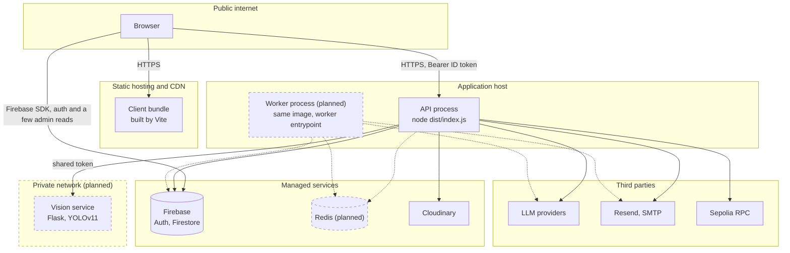
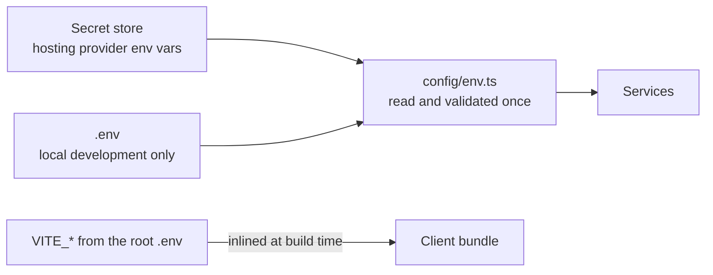

# Deployment

Where the code runs, what may talk to what, and how a secret reaches a process.

## Topology

The vision service is drawn inside a private network because that is where it
belongs. Today it is reachable at whatever `YOLO_SERVICE_URL` points at and
defends itself with a shared bearer token, refusing every request that does not
carry it. The token is the control that exists; the network boundary is the one
that should.

## Environments

| Environment | Purpose          | Data                                                     | Notes                                                  |
| ----------- | ---------------- | -------------------------------------------------------- | ------------------------------------------------------ |
| local       | Development      | Firebase emulator suite, local Redis when phase 20 lands | No real keys, no real email, the LLM stubbed or local  |
| preview     | Per pull request | Seeded emulator                                          | CI deploys, runs the eval harness, tears down. Planned |
| staging     | Pre-release      | A separate Firebase project, synthetic data              | Full third-party integration, Sepolia testnet          |
| production  | Live             | The production Firebase project                          | Feature flags gate anything new in matching            |

The API and the worker ship from the same image with different entrypoints, so
a dependency cannot be present in one and missing in the other.

## Build and run

| Package   | Build                                  | Run                                                                                      |
| --------- | -------------------------------------- | ---------------------------------------------------------------------------------------- |
| `client/` | `npm run build`, Vite, output `dist/`  | Static hosting. Reads `VITE_*` at **build** time, so a rebuild is required to change one |
| `server/` | `npm run build`, `tsc`, output `dist/` | `node dist/index.js`. Reads its environment at **start** time                            |
| `models/` | none                                   | `python app.py`, Flask plus YOLOv11                                                      |

Two consequences of that difference that have bitten this project:

- A `VITE_*` value is compiled into the bundle and readable by anyone who loads
  the site. No secret may ever be one. The LLM keys that used to live there are
  server-side now, and they stay compromised until rotated.
- `shared/domain.d.ts` sits above both packages and both `tsc` runs reach up to
  it. Nothing needs it at runtime and the emitted JavaScript has no reference to
  it, but a deploy that ships only its own package subtree fails the type check
  with `TS2307`. On Vercel that is the "Include source files outside of the Root
  Directory" setting.

## How a secret reaches a process

Rules this diagram is asserting:

- `config/env.ts` is the only place that reads `process.env`. Everything else
  takes a typed value. A missing required variable fails at startup, not at the
  first request that needs it.
- Nothing secret is ever prefixed `VITE_`.
- Two env files, and they are not interchangeable: the root `.env` holds the
  client's public configuration and is read by Vite (`envDir: '..'`), while
  `server/.env` holds every secret. A `client/.env` is never loaded by anything.
- `HANDOVER_CODE_SECRET` is required in production and at least 32 characters.
  Rotating it invalidates every handover code issued before the rotation, which
  is why the hash algorithm version is stored on each record.
- `ADMIN_PRIVATE_KEY` signs live chain transactions from a plain environment
  variable, with no key management, no spend cap and no monitoring. That is
  defect SEC-25 and it is why blockchain writes are off by default. Use a
  dedicated low-value wallet until phase 32 moves it behind a KMS-backed signer.

## Release order

The client and the server deploy independently, and one ordering is safe:

**Server first, then client.** The browser asks for `/api/v1`, which a server
that predates the versioned mount does not serve, so a client-first rollout
404s every request until the API catches up. The other direction is safe in
both states, because the server answers the unversioned path an older client
uses as well as the versioned one a newer client uses.

Nothing enforces this. It is a property of the two mounts described in
[ADR 0013](../adr/0013-api-versioning.md), and the same rule applies to any
future version bump for the same reason.

Two other orderings that matter:

- **Migrations before the deploy that needs them.** Each one in PLAN.md 5.1
  says which phase it gates.
- **`firebase deploy --only firestore` before the code that assumes a new
  index or a tightened rule.** A query with no index fails at runtime, not at
  build time.

## Network and trust boundaries

| Boundary                  | Enforced by                                                                                                                                                      |
| ------------------------- | ---------------------------------------------------------------------------------------------------------------------------------------------------------------- |
| Browser to API            | CORS allowlist from `CLIENT_URL`, Helmet headers, a Firebase ID token verified on every request, and the role resolved from Firestore rather than from the token |
| API to Firestore          | A service account that bypasses the security rules entirely. This is why the rules only ever describe the browser                                                |
| Browser to Firestore      | The rules in `firestore.rules`, tested against the emulator in CI                                                                                                |
| API to the vision service | A shared bearer token that the Flask service requires on every request                                                                                           |
| API outbound              | Nothing yet. There is no host allowlist and no private-range block on outbound fetches, which is defect SEC-23, phase 32                                         |

`helmet` currently runs with `contentSecurityPolicy: false`, so the application
ships no CSP at all (defect SEC-24, phase 32).

## Rules and indexes are code

`firestore.rules` and `firestore.indexes.json` are inert files in the repository
until somebody runs `firebase deploy --only firestore`. Until that happens the
deployed project keeps its old permissions and its old indexes, whatever the
repository says. The rules suite runs against the emulator in CI, which proves
the file is right, not that it is live.
