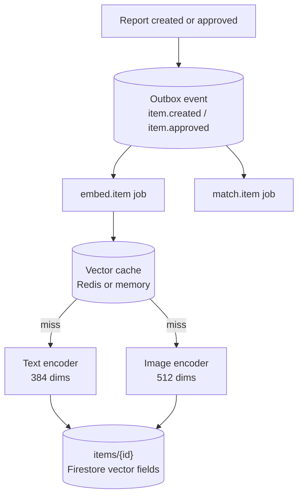

# Embeddings on CPU

How an item becomes a vector, where that vector lives, and what it costs. Built
in phase 22. The decision behind it is
[ADR 0004](../adr/0004-cpu-onnx-embeddings.md), and the store it feeds is
[ADR 0003](../adr/0003-vector-index.md).

## The problem it solves

The matching pipeline had no vectors at all. It loaded every pending item of
the opposite type and asked a language model, once per candidate, how similar
two items were. That is linear in corpus size, non-deterministic, and costs a
network round trip per pair (PLAN.md section 8.1).

There was also an embedding client in the repository that nothing used: it
built a string, logged it, and threw it away (defect AI-03). It was deleted in
phase 18. This phase builds the part that was missing, which was never the
client.

## What runs where



One fact, two consumers. An item becoming visible both needs a vector and
starts a matching run; neither job knows the other exists, and each carries its
own idempotency key so a redelivery runs neither twice.

Both encoders run in this process, on CPU, through ONNX Runtime. No key, no
vendor, no per-item cost, and no item text or photo leaves the deployment,
which is the right default for text describing someone's lost property.

## The models

| Role  | Model                          | Dimensions | Precision   | Set by                  |
| ----- | ------------------------------ | ---------- | ----------- | ----------------------- |
| Text  | `Xenova/bge-small-en-v1.5`     | 384        | int8 (`q8`) | `EMBEDDING_MODEL`       |
| Image | `Xenova/clip-vit-base-patch32` | 512        | int8 (`q8`) | `EMBEDDING_IMAGE_MODEL` |

`bge-small-en-v1.5` rather than `all-MiniLM-L6-v2`: both emit 384 dimensions,
so they are interchangeable with a backfill and no schema change, and the
former is meaningfully stronger on retrieval for about ten megabytes more.
Lost-and-found text is short, so the extra layers cost little wall clock.

The image model is the vision tower of CLIP. Nothing consumes it yet. It is
built now because it is what turns the CCTV feature from "some object of this
category was on camera" into "this object was on camera" (PLAN.md section
21.2), and because computing it at upload rather than at query time is the
whole point.

Measured on this repository, single-threaded, after a warm model load:

| Measurement                            | Value                    |
| -------------------------------------- | ------------------------ |
| Text encode                            | 8 to 12 ms per item      |
| Image encode                           | ~38 ms per image         |
| Model load, warm cache                 | ~300 ms per model        |
| Vector length after normalisation      | 1.0000 for both encoders |
| Similar pair vs unrelated pair, cosine | 0.865 vs 0.619           |

That last row is the one worth keeping: two descriptions of the same wallet
score 0.865 against each other and 0.619 against a bicycle, which is the signal
retrieval will rank on in the next phase. It is a sanity check, not an
evaluation. The labelled eval set that decides whether a model is good enough
to keep is phase 24, and ADR 0004 is explicit that no model is adopted on
reputation.

## Normalisation

Both encoders emit unit-length vectors, so a dot product is a cosine
similarity. The text pipeline is asked to normalise; the CLIP projection head
does not, so the image embedder does it itself. This matters because the
Firestore nearest-neighbour query in the next phase cannot normalise for us:
whatever is stored is what gets compared.

## What is stored, and what is not

Vectors live on the item document rather than beside it, because a
nearest-neighbour query has to filter by type, status and time in the same
query it ranks by distance. Splitting them into their own collection would mean
fetching a large candidate set and filtering it in application code (ADR 0003).

| Field                 | Type             | Meaning                                  |
| --------------------- | ---------------- | ---------------------------------------- |
| `embedding`           | Firestore vector | The text vector, 384 dimensions          |
| `imageEmbedding`      | Firestore vector | The image vector, 512 dimensions         |
| `embeddingKey`        | string           | Hash of the model, revision and the text |
| `embeddingModel`      | string           | `id@revision`, so a swap is detectable   |
| `imageEmbeddingModel` | string           | The same, for the image encoder          |
| `embeddedAt`          | timestamp        | When it last ran                         |

They are stored as native Firestore vector values, not arrays of numbers,
because that is the type `findNearest` indexes. Storing plain arrays now would
have meant a full backfill before retrieval could use them.

**They never leave the server.** Every read path in `item.repository.ts`
spreads a document straight to a caller that serialises it to a browser, so the
mapper strips the vector fields on the way out and the one caller that wants
them, `findByIdWithVectors`, asks by name. A 384-float vector per item on a
list endpoint is kilobytes of payload nobody asked for.

## Cost control

An item is embedded once in its lifetime. `embeddingKey` is a hash of the
model, its revision, and the exact text that went in, so a moderation flag
flipping, a match score being written, or a re-run of the backfill all leave it
alone and cost nothing. Only a change to the text the item is described by
produces a new key and a new vector.

The text hash is not the whole test, though. The image half is best effort, so
a photo that timed out on the first run leaves an item with a text vector and
no image vector, and stopping at the hash would call that finished for good:
the approval re-run and the backfill after it would both report `unchanged`.
An item that has a fetchable photo and no vector for it is still owed work, and
on that pass the text vector is reused rather than recomputed.

The cache is keyed on the bytes that went into the model, not on the URL they
came from. A URL is only a safe key while every upload produces a new one,
which is true of the current Cloudinary call and stops being true the moment
any upload path sets a deterministic `public_id` and overwrites. It lives in
Redis, shared by the API and every worker.

A stale image vector is cleared rather than left. An item whose description was
edited and whose photo was replaced with one that cannot be read would
otherwise keep ranking on a picture it no longer has.

## Model files

Weights are downloaded on first use into `MODEL_CACHE_DIR` (default
`./.models`, gitignored), not committed: roughly 115 MB, and every future model
swap would add more history forever.

```bash
npm run warm-models      # fetch both models into the cache
```

Run that in a container build. Then set `EMBEDDINGS_OFFLINE=true` at runtime so
a deployment with a warm cache refuses the network rather than reaching out on
first request.

Revisions default to `main`, which follows the repository. That is fine locally
and wrong in production: pin a commit, because a model that changes under a
corpus of stored vectors makes them incomparable to each other.

## Threads

ONNX Runtime defaults to one thread per core. In a container with a fractional
CPU allocation that is oversubscription, and inference gets slower the more
cores the host reports. `EMBEDDING_THREADS` pins both the ONNX intra-op count
and OpenMP's, and defaults to 1. Raise it to the CPU the container actually
has.

## Backfill

Items that existed before this phase raised no event, so nothing embedded them.

```bash
npm run backfill:embeddings            # dry run, counts the work
npm run backfill:embeddings -- --apply # embeds and writes
```

It runs the same service the job does, one item at a time, because it is a
background chore competing with a live API for the same pinned threads.
Interruptible and re-runnable: an item whose stored hash already matches is
skipped.

## Where the code is

| File                                           | What it is                                        |
| ---------------------------------------------- | ------------------------------------------------- |
| `platform/ai/ports/embedding.port.ts`          | The ports, declared in phase 21                   |
| `platform/embeddings/models.ts`                | Which models, pinned to which revision            |
| `platform/embeddings/runtime.ts`               | Cache location, thread pinning, lazy shared loads |
| `platform/embeddings/text.embedder.ts`         | `EmbeddingProvider`, mean pooled and normalised   |
| `platform/embeddings/image.embedder.ts`        | `ImageEmbedder`, the CLIP vision tower            |
| `platform/embeddings/embedding.cache.ts`       | Content-hash cache, Redis or memory               |
| `platform/embeddings/image.source.ts`          | Fetching image bytes, with the host allowlist     |
| `services/embedding.service.ts`                | What text stands for an item, and what is stored  |
| `platform/jobs/handlers/embed-item.handler.ts` | The job                                           |
| `scripts/backfill-embeddings.ts`               | The one-off pass over existing items              |
| `scripts/warm-models.ts`                       | Prefetch for a container build                    |

## Operating it

- **Is it on?** `EMBEDDINGS_ENABLED`. False computes and stores nothing, and
  the job returns `disabled`.
- **Did an item get a vector?** The job logs `Embedding run finished` with an
  outcome of `embedded`, `unchanged`, `skipped` or `disabled`.
- **Why is an item skipped?** It has no text at all, or it was deleted between
  the event and the job.
- **Why has an item no image vector?** The photo could not be fetched, was not
  from a host this deployment uploads to, or could not be decoded. The text
  vector is stored regardless: it is the one retrieval runs on.
- **A model changed.** `embeddingModel` on each item records `id@revision`.
  Change the model, then run the backfill: vectors from two models are not
  comparable, so a partial corpus ranks badly rather than obviously wrongly.
- **An item was edited and its vector is stale.** Editing raises no outbox
  event today, so nothing re-enqueues the job. The backfill repairs it. Adding
  an `item.updated` event is the real fix and belongs with the retrieval phase
  that makes a stale vector matter.
- **Ordering.** `embed.item` and `match.item` are enqueued in that order from
  one event, but they run on separate queues consumed concurrently, so that is
  enqueue order and not run order. Matching does not read vectors yet; when it
  does, it needs a real dependency rather than this ordering.

## Security note

The worker only ever has a Cloudinary URL, because raw bytes arrive in the
create request and are dropped once uploaded. Fetching them back is an outbound
request driven by a value read out of a document, which is the shape of a
server-side request forgery (defect SEC-23). It is constrained rather than
trusted:

- HTTPS only, and a host allowlist,
- **checked again on every redirect hop**, which is why redirects are followed
  by hand with `redirect: 'manual'` rather than left to `fetch`. An allowlist
  applied only to the first URL is no allowlist: a stored Cloudinary URL that
  answers 302 to an internal address would otherwise be fetched and decoded,
- an image content type,
- an 8 MB cap checked against `content-length` and then enforced chunk by
  chunk while the body is read, so an absent or understated length cannot put
  an unbounded response on the worker's heap,
- and a 10 second timeout over the whole thing.

A URL failing any of those is skipped rather than retried, because it is a bad
reference and asking again produces the same bad reference.
