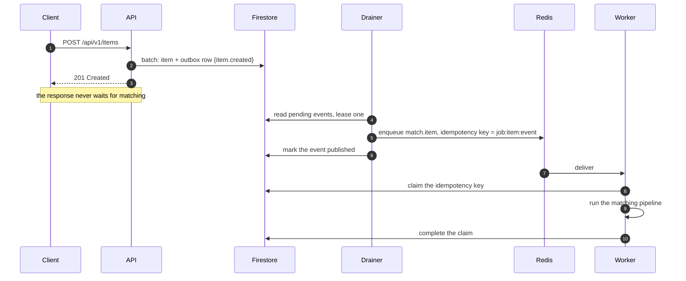

# Jobs, the outbox, and tracing

How background work is committed, dispatched, retried and given up on. Built in
phase 20. The decision behind it is [ADR 005](../adr/0005-redis-job-queue.md).

## The problem it solves

Before this, work that had to happen after a write was a detached promise:

```ts
void this.runMatchingInBackground(created.id, input, urls);
```

Three things follow from that shape. A restart in the seconds after a report is
saved loses the matching run with no record that it was owed. A provider outage
is one log line and nothing retries. And the work runs in the process that is
also serving requests, so a slow LLM call is paid for by every user.

The fix is the standard one: commit the intent with the state, dispatch from
the committed record, and run it somewhere else.

## The path



The drainer and the worker are the same process (`npm run worker`). They are
drawn apart because they fail apart: a drainer that cannot reach Redis backs
off and the events stay pending, which is recoverable, while a worker that
cannot reach Firestore fails the job, which is retried.

## Guarantees, and what they are not

| Property                          | How                                                                          |
| --------------------------------- | ---------------------------------------------------------------------------- |
| An event is never lost            | It is written in the same Firestore batch as the state change that raised it |
| An event is published once        | A transactional lease, so two drainers cannot take the same row              |
| A job runs at least once          | Redis delivery plus retries with exponential backoff                         |
| A job's effect happens once       | `jobClaims/{key}`: the claim holder runs, everyone else stands down          |
| A job that will not work is found | Retries exhausted writes `deadLetters` with the payload and the trace id     |
| Work is traceable end to end      | The `traceparent` travels on the event, then on the job, and reaches the log |

This is at-least-once delivery with an idempotency key, not exactly-once
delivery. Exactly-once does not exist across two systems; a claim that makes
the effect idempotent is what does.

## The pieces

| File                                   | What it is                                                                |
| -------------------------------------- | ------------------------------------------------------------------------- |
| `platform/outbox/event.catalog.ts`     | The events, their payloads, their versions, and which job each dispatches |
| `platform/outbox/outbox.repository.ts` | `append(batch, event)`, the lease, and the terminal states                |
| `platform/outbox/outbox.drainer.ts`    | The poll loop, the backoff, and the dead row                              |
| `platform/jobs/job.types.ts`           | The job catalogue and the retry policy per job                            |
| `platform/jobs/queue.port.ts`          | `JobQueue`, `JobHandler`, `DeadLetterSink`. Neither side names Redis      |
| `platform/jobs/bullmq.queue.ts`        | The Redis producer. One queue per job name                                |
| `platform/jobs/bullmq.worker.ts`       | The Redis consumer, its lock, and the dead letter on the final attempt    |
| `platform/jobs/inline.queue.ts`        | The in-process driver, for a machine or a test with no Redis              |
| `platform/jobs/job.runner.ts`          | Claim, trace, timeout, complete or release. Shared by both drivers        |
| `platform/idempotency/*`               | `jobClaims`, the lease that makes a redelivery a no-op                    |
| `platform/tracing/context.ts`          | W3C `traceparent` in an `AsyncLocalStorage`, read by the logger           |

## The event catalogue

| Event           | Raised by                              | Dispatches                                                                                      |
| --------------- | -------------------------------------- | ----------------------------------------------------------------------------------------------- |
| `item.created`  | `POST /items`, in the item's own batch | `match.item`, only when created by an admin, because an admin's own report is approved on write |
| `item.approved` | `PUT /items/:id/moderate`, approving   | `match.item`, `embed.item`                                                                      |
| `handover.verified` | The handover state machine, in the same transaction as the transition to `verified` | `handover.items`, `handover.archive`, `handover.credits`, `handover.notify`, `handover.chain` |

`handover.verified` is the completion saga (PLAN.md 10.2). Completing a
handover has five side effects, and they used to run inline as a batch plus
three fire-and-forget blocks, so a failure past the batch left the item
statuses, the match record and the credits disagreeing about whether the
handover had happened. Each is now a job with its own retry policy, its own
dead-letter queue and its own idempotency key, and a step that exhausts its
retries raises an escalation carrying the compensation an admin would need.
See [state machines](state-machines.md) for the table.

Versioning rule: add fields, never repurpose one. A change an old consumer
could not read is a new `version`, and the drainer handles both until the last
old row has drained.

A manual rematch raises no event. It changes no state, so there is nothing for
an event to ride with, and it enqueues the job directly with a key bucketed by
the minute, which turns a double-clicked button into one run.

## Retry and dead-letter policy

| Job          | Attempts | Backoff       | Attempt timeout | On give-up                        |
| ------------ | -------- | ------------- | --------------- | --------------------------------- |
| `match.item` | 3        | 10s, doubling | 120s            | `deadLetters` document, job fails |

An outbox row that cannot be published has its own budget: five attempts, five
seconds doubling to a five-minute cap, then `status: 'dead'`. It stays in the
collection rather than moving, because a row that has been deleted is a side
effect nobody knows was lost.

## Running it

| Mode                     | Command                                                           | Behaviour                                                                                            |
| ------------------------ | ----------------------------------------------------------------- | ---------------------------------------------------------------------------------------------------- |
| API and worker (default) | `docker compose up -d redis`, `npm run dev`, `npm run dev:worker` | The API writes events, the worker drains and runs them                                               |
| API only, no Redis       | `npm run dev` with `REDIS_URL` unset                              | The API drains its own outbox and runs jobs in-process. Nothing survives a restart, and boot says so |

`npm run worker` refuses to start without `REDIS_URL`: a worker with no queue
would idle forever, and saying so is more useful.

The in-process mode is a supported degraded mode, not a second design. It
exists so a developer machine and CI behave like production in everything a
caller can observe, and it is what the system did before this phase.

## Operating it

- **Is anything stuck?** `outbox` where `status == 'pending'` and `attempts > 0`
  is publication that is failing. `status == 'dead'` is publication that gave
  up.
- **Did a job fail?** `deadLetters`, newest first. Each carries the payload, the
  attempt count, the error and the `traceId`.
- **Replay a dead letter.** Fix the cause, then enqueue the same job with a new
  idempotency key. Reusing the old key is a no-op by design.
- **Follow one request.** Every log line carries `traceId`. The client is sent
  the same value in the `traceparent` response header, so a user report can be
  tied to the exact run.

## Firestore collections

| Collection    | Written by     | Read by        | Retention                                             |
| ------------- | -------------- | -------------- | ----------------------------------------------------- |
| `outbox`      | Any API write  | The drainer    | Kept. Published rows are safe to prune after a week   |
| `jobClaims`   | The job runner | The job runner | `expiresAt` is set for a Firestore TTL policy, 7 days |
| `deadLetters` | Both drivers   | A person       | Kept until the failure is understood                  |

All three are denied to the browser in `firestore.rules`, explicitly as well as
by the catch-all.

The TTL policy on `jobClaims.expiresAt` is a console setting, not code, and is
listed in `PLAN.md` section 5.1. Without it the collection grows by one small
document per job forever.
