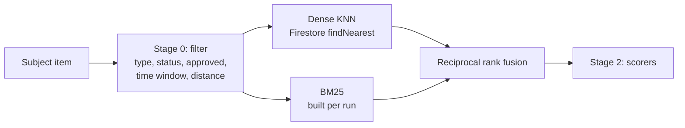

# Hybrid retrieval

How a matching run decides which candidates are worth scoring. Built in phase 23. The decision behind the store is [ADR 0003](../adr/0003-vector-index.md),
and the vectors it searches come from
[the embeddings note](embeddings.md).

## The problem it solves

Ordering by exact token overlap decides what the semantic scorer never sees. A
genuine pair whose wording does not overlap — "iPhone 13" against "Apple phone"
— sorts to zero, falls off the end of the cap, and is never scored. That is the
same hard token gate the pipeline removed as a filter, still deciding the
outcome as an ordering.

**This phase changes the ordering, not the read.** The pipeline still loads the
pending items of the opposite type once per run: the lexical half needs a
corpus to score against, and giving it one without a full read would mean a
separate lexical index, which ADR 0003 lists as unsolved. So the cost is
unchanged and the candidate selection is better. Cutting the read itself is a
later decision, and it is the one that needs the second store.

## The stages

| Stage      | Method                                                             | In     | Out    | Owner              |
| ---------- | ------------------------------------------------------------------ | ------ | ------ | ------------------ |
| 0 Filter   | Opposite type, open, approved, inside the time and distance limits | All    | 50-500 | The pipeline       |
| 1 Retrieve | Dense KNN over item vectors, plus BM25, fused by rank              | 50-500 | Top 50 | `RetrievalService` |
| 2 Score    | The existing semantic, visual, colour, location and time scorers   | Top 50 | Top 25 | The pipeline       |

Stage 0 stays where it was, and the retrieval stage is handed its output rather
than querying for it again. An earlier draft of this phase had retrieval run
its own stage 0, which doubled the Firestore reads of every matching run to
rebuild a subset of the list the caller already held.



## Identifiers outrank everything

A serial number, a model number, an IMEI, a registration, a name written inside
a bag. Two reports carrying the same one describe the same object, and no
amount of agreement about "black" and "backpack" is comparable evidence.

Three things follow, and all three were measured rather than assumed:

- The tokeniser keeps a hyphenated identifier whole as well as split.
  `WH-CH720N` used to become `wh` and `ch720n`, which destroyed the exact term
  in the one case lexical retrieval exists to win.
- BM25 weights an identifier term three times an ordinary one. IDF already
  rewards a rare term, but not enough to beat a candidate sharing half a dozen
  common words.
- A candidate sharing an identifier with the subject is promoted ahead of the
  fused order. This matters most against the dense half, which blurs one
  identifier into every other and can bury a candidate lexical ranked first.

Together they took lexical recall@1 from 0.556 to 0.667 and hybrid from 0.778
to 0.889 on the labelled set. The prompts that write item descriptions ask
explicitly for any identifier, in the description and as its own tag, which is
what makes the signal available in the first place.

## Why both retrievers

They fail in opposite directions, so section 8.2 fuses them rather than
choosing.

| Query                       | Dense                   | Lexical                 |
| --------------------------- | ----------------------- | ----------------------- |
| "Apple phone" / "iPhone 13" | Finds it                | Nothing in common       |
| IMEI `356938035643809`      | Blurs into every number | Exact hit               |
| A name written in a bag     | Weak                    | Exact hit               |
| A paraphrased description   | Strong                  | Depends on shared words |

Lost-and-found text is short and full of proper nouns, which is exactly the
shape where a lexical index still earns its place.

## Why rank fusion rather than adding scores

A cosine distance is bounded and roughly calibrated. A BM25 score is unbounded,
corpus-relative, and changes scale with the length of the query. Adding them
means inventing a normalisation and then defending it.

Reciprocal rank fusion uses only the order each retriever produced: each list
contributes `1 / (60 + rank)`. A document both retrievers rank highly beats one
that either ranks first alone, and no retriever's score scale enters into it.
The constant is large on purpose — at 60 the gap between rank 1 and rank 2 is
small, so agreement outweighs one retriever's confidence.

## The filters, and where each one runs

Firestore serves a vector query from a composite index whose non-vector fields
are equality-filtered, so `type` and `status` go into the query and the range
predicates do not. Time, distance and moderation are enforced by intersecting
the hits with the set stage 0 already produced.

The dense query therefore over-fetches: `k` is the larger of four times the
output limit and the size of the candidate set. Sizing it against the limit
alone is the trap — the query ranks the whole collection, so over a national
corpus the nearest 200 vectors are dominated by items outside the time and
distance window, the intersection comes back empty, and the dense half stops
contributing exactly as the corpus grows.

Moderation is never a `where` clause: an item created before moderation existed
has no such field, and an equality filter would exclude the entire existing
corpus.

**A vector hit is intersected with stage 0, never trusted on its own.** The
query could only enforce two of the five predicates, so a hit that is six
months old or two hundred kilometres away is dropped before it can become a
candidate.

## The distance bound

A nearest-neighbour query returns the k nearest however far away they are, so a
corpus containing nothing related still yields k confident-looking candidates.

The bound is a **Firestore COSINE distance**, which is `1 - cosine similarity`.
Getting the unit right matters: the two scales are easy to conflate, and a
threshold reasoned about in the wrong one is a threshold that admits
everything. From the phase 22 measurements on this encoder, two descriptions of
the same wallet scored 0.865 cosine and a wallet against a bicycle 0.619 —
distances of 0.135 and 0.381. The ceiling is 0.35, below the unrelated pair and
well above the true one.

`denseSimilarity` on a candidate is a cosine similarity for the same reason:
`1 - distance`, not a rescale of the [0,2] range onto [0,1], which would read
0.6 for a pair whose actual cosine is 0.2.

## The subject's own vector

Computed on demand when the item does not have one stored, rather than waiting
for the embedding job.

A report and its matching run leave the same outbox event onto two queues that
are consumed concurrently, so a brand-new item usually reaches matching before
it has been embedded. Chaining the jobs would fix the order and couple them: an
embedding that dead-lettered would take matching with it. Embedding the
subject's text here costs about ten milliseconds and is cached, which is
cheaper than that coupling. The corpus vectors still have to be pre-computed,
which is what the backfill is for.

## Rollout

`RETRIEVAL_MODE` has three settings and defaults to the middle one.

| Mode     | Vector query | What is scored        |
| -------- | ------------ | --------------------- |
| `off`    | No           | The previous ordering |
| `shadow` | Yes          | The previous ordering |
| `on`     | Yes          | What retrieval chose  |

`shadow` runs the whole new path and logs how far its top candidates agree with
the ones the previous ordering would have scored, and changes nothing:

```
Retrieval shadow { filtered: 143, denseUsed: true, legacyHead: 25, newHead: 25, overlap: 21, ms: 38 }
```

Read those numbers before flipping the flag. A low overlap is the signal to
look at why, not a reason the flag cannot be flipped: the two orderings are
_supposed_ to disagree, because the point is retrieving pairs the lexical
ordering dropped. What the overlap tells you is how big a behaviour change
turning it on would be.

Every failure falls back to the previous ordering — a missing index, a failed
query, an empty result. Retrieval is an optimisation over a linear scan that
already works, and it must never be the reason a matching run produces nothing.

Retrieval also never shrinks the field. Whatever the two retrievers did not
rank keeps the caller's order behind what they did, up to the limit. A BM25 that
matched two of forty candidates must not reduce the field to two: that would
reinstate the exact token-overlap gate this phase exists to remove.

What shadow is not: free. It runs on every matching run and costs one vector
query, one BM25 build over the candidate set, and — for a subject that has not
been embedded yet — one local inference of about ten milliseconds. The first
matching run in a fresh process also pays the model load unless the image was
built with `npm run warm-models`.

## Before turning it on

1. Deploy the vector index: `firebase deploy --only firestore:indexes`. Until
   it exists, `findNearest` fails with `FAILED_PRECONDITION` and retrieval logs
   it once and returns nothing.
2. Embed the corpus: `npm run backfill:embeddings -- --apply`. An item with no
   vector can never be a dense hit.
3. Watch the shadow numbers.

## Where the code is

| File                                               | What it is                                    |
| -------------------------------------------------- | --------------------------------------------- |
| `platform/vector/vector.port.ts`                   | The port from ADR 0003                        |
| `platform/vector/firestore.vector.index.ts`        | `findNearest`, with the missing-index warning |
| `services/matching/retrieval/retrieval.service.ts` | Stages 0 and 1, and the shadow comparison     |
| `services/matching/retrieval/bm25.ts`              | The lexical half, built per run               |
| `services/matching/retrieval/fusion.ts`            | Reciprocal rank fusion                        |
| `services/matching/matching.pipeline.ts`           | Where the mode is read and the fallback lives |

## Operating it

- **Retrieval finds nothing.** Check for `Vector search needs a composite index
that does not exist yet` in the logs; that is the deploy step, not a bug.
- **`denseUsed: false`.** Either embeddings are off, or no candidate in the
  filtered set has a vector yet. Run the backfill. It is reported in `on` mode
  as well as in shadow, on purpose: once the flag is flipped, a dense half that
  never contributes is otherwise invisible and the only symptom is matching
  quietly getting worse.
- **The overlap is low.** Expected to some degree, since the point is to
  retrieve pairs the lexical ordering dropped. Compare a few runs by hand
  before deciding.
- **Turning it off** is `RETRIEVAL_MODE=off`, which also stops the vector query.

## What this phase does not do

It narrows the field; it does not decide anything. The scorers above still
decide whether a pair is a match, and the dense similarity that retrieval
computed is carried on the candidate but is not yet a scoring signal — folding
it into the score, and replacing the Clarifai concept-overlap heuristic with
the image vector, is section 8.5 and a later phase.
