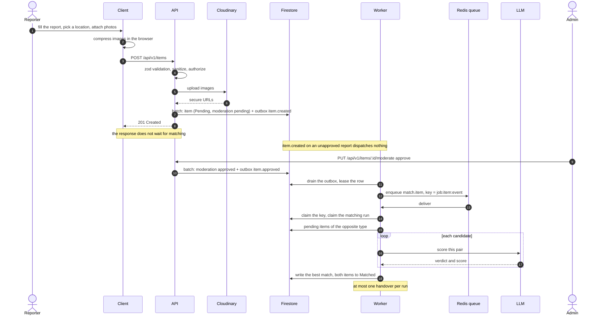
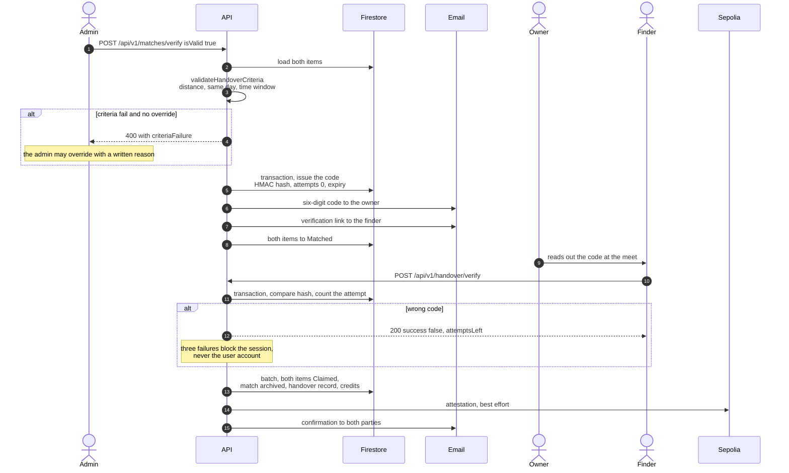
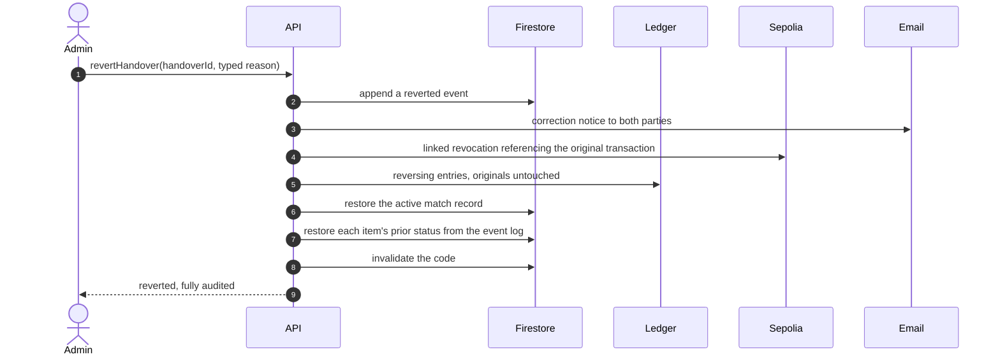
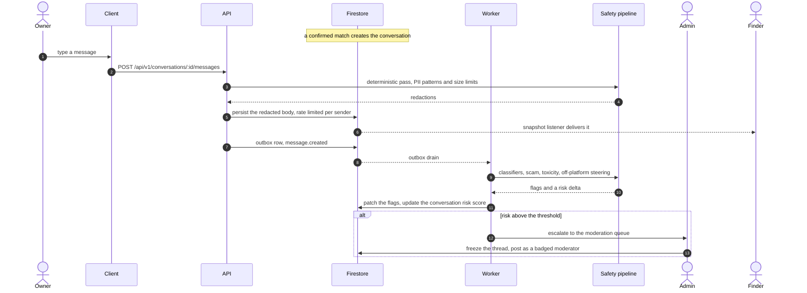

# Sequences

The four flows worth drawing: the ones that cross a boundary, run partly
outside the request, or have to be undone.

## Report to match

Today. The report and the intent to match it commit together; the run happens
in the worker.

Approval is what starts matching, not creation. An unapproved report is
invisible and unmatchable, which is the moderation gate phase 10 introduced,
and its `item.created` event is published with nothing dispatched.

Two claims guard the run, because they guard different things. The idempotency
key stops a redelivered job from running twice; the matching-run claim on the
item stops two different events, such as an approval and a rematch a second
later, from scoring the same item at once.

The loop that used to grow with the corpus is gone: retrieval narrows the
field, and one batched call scores what is left. What the diagram does not show
is the last stage, which runs only when the best pair scores inside the
uncertainty band — see [the adjudication agent](adjudication.md).

## Match to handover to completion

The batch is the reliability boundary. Four collections move together; the
chain write and the emails are outside it and are best effort, which is why a
failed email cannot lose a completed handover but also cannot be retried. The
outbox in phase 20 closes that.

A session blocked by three wrong codes has exactly one way back: an admin
re-issues it from the open-handovers panel. The code is hashed, so nobody can
look up the old one.

## Revert (planned, phase 27)

Never a delete. Every forward step has a compensation and they run in reverse.

Two properties make this safe. The prior state is read from the event log
rather than guessed, and credits are corrected with reversing entries rather
than edits, so the history stays true. The operation is idempotent and
admin-only.

## Chat with moderation (planned, phase 29)

Replaces mailing one user's address to another, which is defect SEC-22.

Reads are Firestore snapshot listeners scoped by security rules to the two
participants plus admins, which is [ADR 008](../adr/0008-firestore-chat.md);
writes go through the API like every other write in this system. That split is
what lets PII be masked before the message is persisted rather than hidden at
read time, while the slower classifiers run after delivery so they cannot delay
a message.
