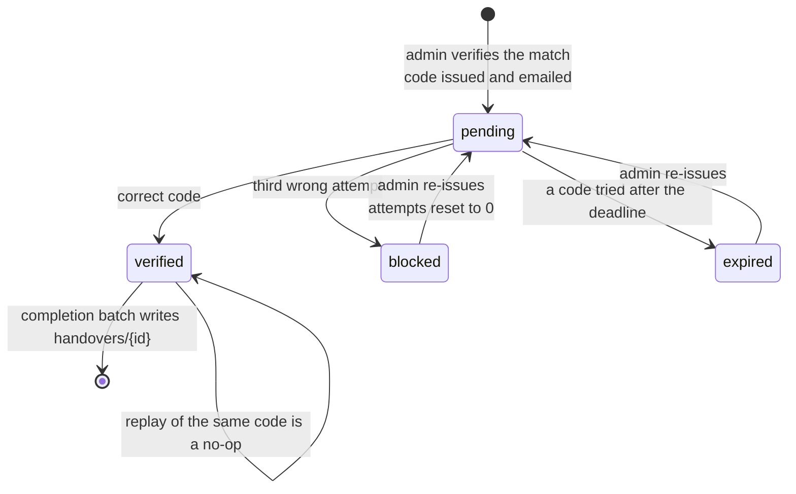
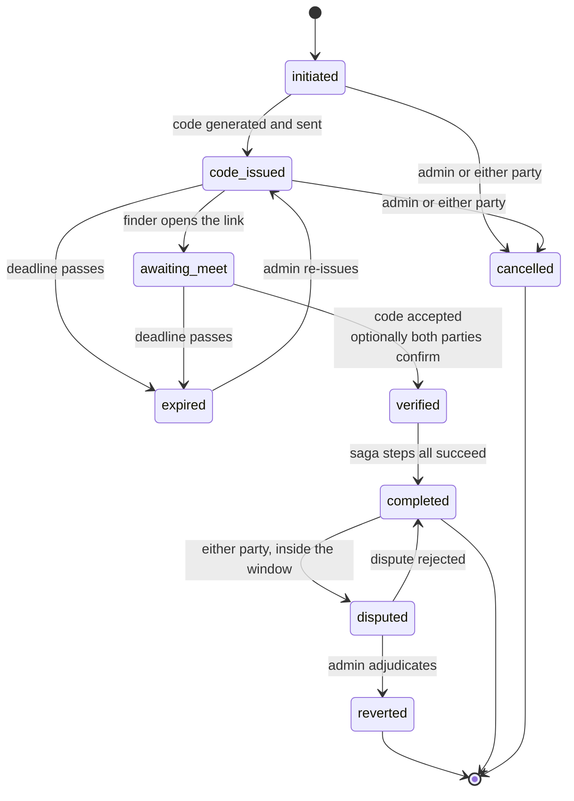
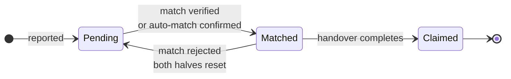
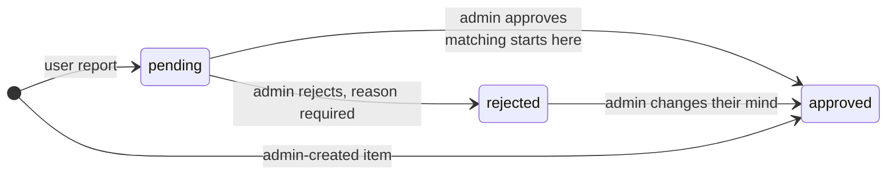
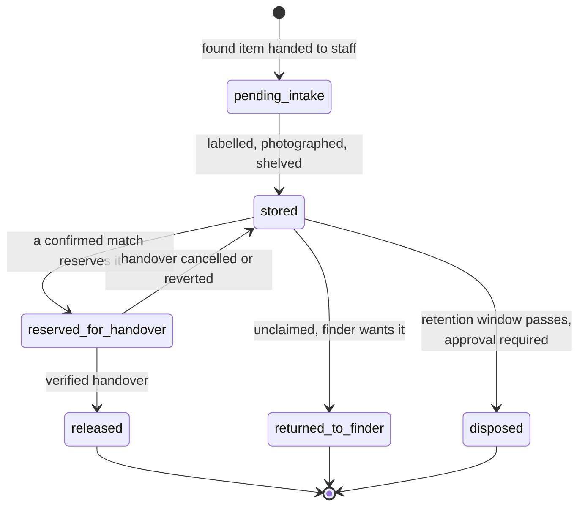

# State machines

Three things in this system have a lifecycle: the handover, the item, and
(planned) the physical custody of an object. Each is drawn as it behaves now,
with the target called out where they differ.

## Handover

Today the state lives in one field on `handoverCodes/{matchId}`.



Four rules the diagram is enforcing:

- Three wrong attempts block the **session**, never the user's account. The
  person typing the code is the finder; blocking the owner's account for the
  finder's typos was defect LOG-12.
- Only an admin re-issue clears the attempt budget. A plain re-trigger of an
  open session keeps it, so re-running matching cannot hand fresh guesses to
  whoever is grinding the code.
- `expired` is only written when somebody actually tries a code after the
  deadline. A session nobody attempted stays `pending` with its expiry in the
  past, which is why the admin panel derives the state it displays from
  `expiresAt` rather than trusting the stored value.
- A verified session is terminal. There is no transition back, so a re-issue
  cannot reopen a completed handover.

### Target, phase 26

States become `initiated`, `code_issued`, `awaiting_meet`, `verified`,
`completed`, `expired`, `cancelled`, `disputed`, `reverted`, and every
transition is an appended event rather than a field write:

```
handoverEvents/{id} = { handoverId, from, to, actor, actorRole, reason, metadata, at }
```

Current state becomes a projection of the log. That gives an audit trail for
free, makes a dispute resolvable, and makes a revert safe, because the prior
state is recorded rather than reconstructed. It also removes a whole class of
bug by construction: a transition that is not in the table cannot happen, so a
re-trigger can never silently rewind a blocked session (defect LOG-11).



## Item lifecycle



`status` and `moderation` are independent fields, which is the distinction
phase 10 settled:



`status` answers "has this item found its counterpart". `moderation` answers
"may this item be seen and matched at all". Conflating them is what made
"Pending" mean both "not yet matched" and "not yet approved".

Two details that matter when reading data:

- A document with no `moderation` field predates review and reads as approved.
  It is filtered in memory rather than with a `where`, because an equality
  filter would have hidden the entire existing corpus the moment it deployed.
- `Resolved` is retired. It was a second terminal state written only by the
  verification agent while the handover flow wrote `Claimed`, and every
  dashboard counts `Claimed`, so anything closed through verification vanished
  from the metrics. The agent is gone and the migration rewrites the documents.

## Custody (planned, phase 30)

An item is a report today. It is never a physical object on a shelf with a
keeper. This is the missing lifecycle.



Every movement is a `custodyEvents` row and the current location is a
projection, exactly as with handover state. That is what makes the chain of
custody provable, which matters legally for found property. Retention and
disposal are a legal requirement in most jurisdictions and the system has no
concept of them today.
