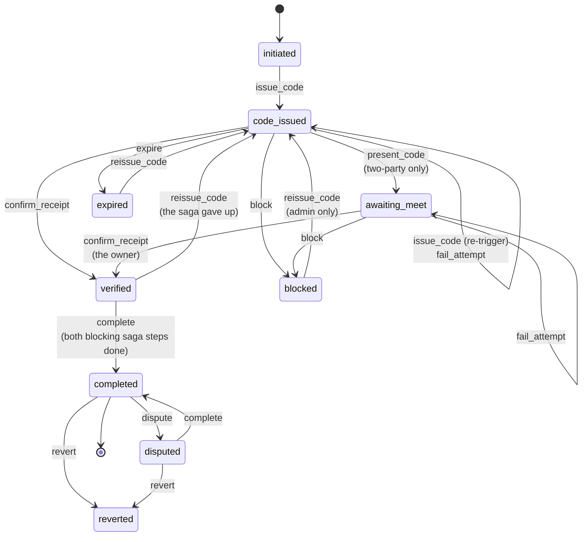
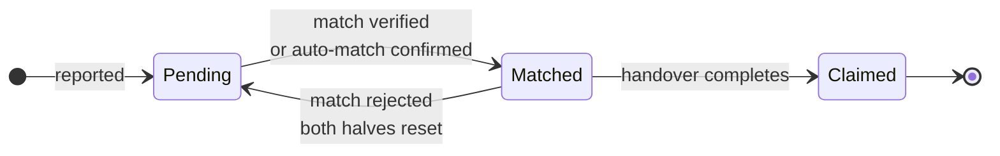
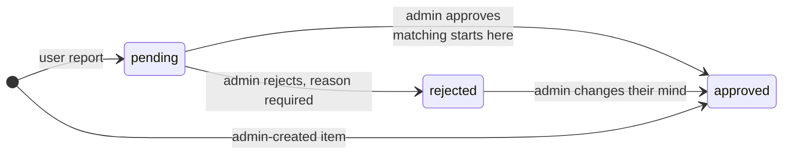
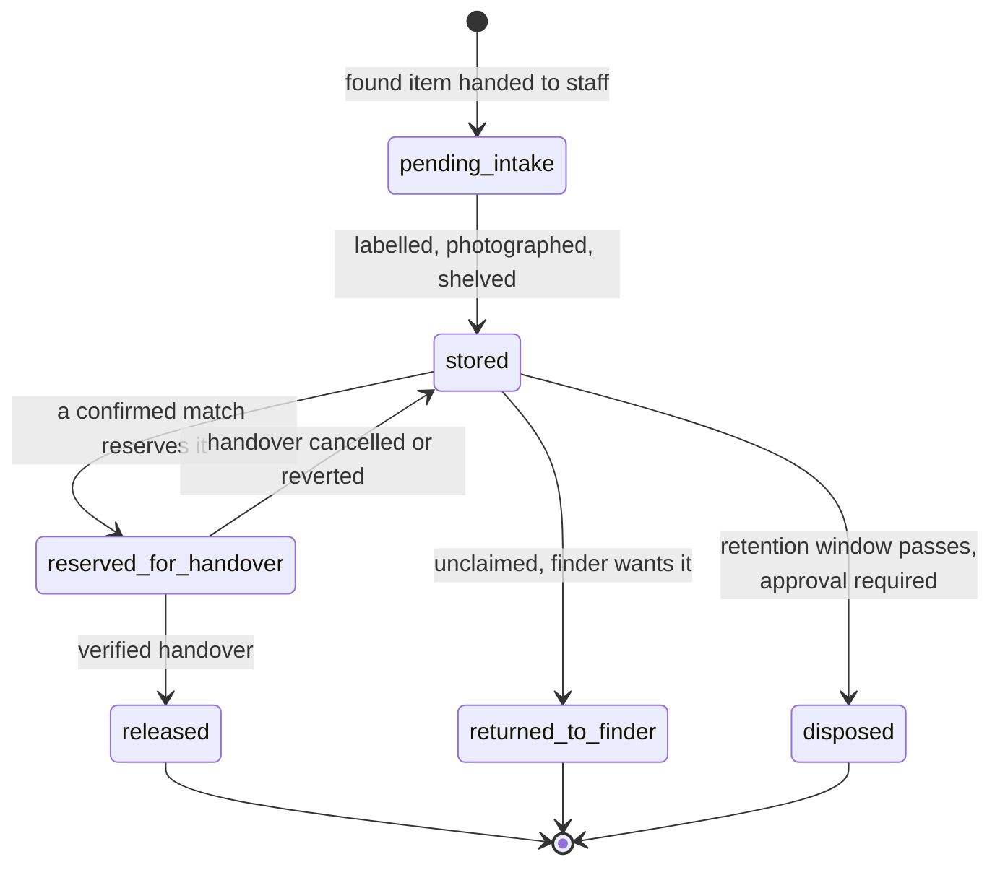

# State machines

Three things in this system have a lifecycle: the handover, the item, and
(planned) the physical custody of an object. Each is drawn as it behaves now,
with the target called out where they differ.

## Handover

State is a projection of an append-only event log, `handoverEvents`, and every
move is a row in it (PLAN.md 10.1). The current state is materialised onto
`handoverCodes/{matchId}` in the same transaction that appends the event, so
the log is the source of truth and the document is a cache of its last entry
that every existing reader already reads.

### What the table refuses, and why that is the point

The rules below used to be checks that each new code path had to remember. Now
they are absences in the transition table, so a path added later cannot break
them without deliberately adding an edge.

- **`blocked` has no `issue_code` edge.** Only an admin `reissue_code` reopens
  a blocked session. Defect LOG-11 was `initiateHandover` overwriting the code
  document and silently unblocking it; the fix then was a guard on that one
  path, and this is the same rule with nowhere left to forget it.
- **`completed` leads only to `disputed` and `reverted`.** A completed handover
  is a fact about the physical world. The only honest moves from it are to
  challenge it or to compensate for it, never to quietly rewind it — and
  because there is no second `complete` edge, a replayed saga step writes one
  event rather than two.
- **Three wrong attempts block the session, never an account.** The person
  typing is the finder; blocking the owner's account for the finder's typos was
  defect LOG-12. Attempts are also spaced by a doubling backoff, because the
  cap bounds how many guesses a session allows without bounding how fast they
  arrive.
- **A plain re-trigger keeps the attempt budget.** Only an admin re-issue
  clears it, so re-running matching cannot hand fresh guesses to whoever is
  grinding the code.
- **`verified` can be reopened.** Not a rewind: nothing has completed. The
  completion saga can give up, and a session left verified with no handover
  record behind it would otherwise be stranded.

### Two-party confirmation

`HANDOVER_TWO_PARTY` is off by default, which is the single-step flow: the
credential is presented and the handover goes straight to `verified`. On,
presenting it means only that the two have met, and the *other* party has to
confirm before anything is credited or archived. `awaiting_meet` is the state
between the two, and it is unreachable with the flag off.

Which party confirms is the whole security argument, and it is not the obvious
one. The six-digit code is emailed to the person who reported the **lost**
item and the verification link to the person who reported the **found** item,
so the owner already holds the credential. Gating confirmation on the owner as
well would let one person present their own code and then confirm their own
receipt — one party closing a handover, which is exactly what this exists to
stop. So `POST /handover/confirm` requires the **found** item's reporter:
the owner cannot confirm, and the finder cannot present a code they were never
sent.

The public verify endpoint can never confirm while the flag is on. It only
ever moves `code_issued` to `awaiting_meet`; a credential presented against a
session already in `awaiting_meet` is answered "already accepted" rather than
falling through. That branch is the one thing standing between two-party and
one unauthenticated request being sent twice.

The credential is six digits or a signed QR token. The token carries its own
expiry and its own binding to the handover, and it is verified by an HMAC
rather than a read, so nothing is stored and nothing has to be expired.

### Completion is a saga, not a batch

Reaching `verified` writes one outbox row, `handover.verified`, in the same
commit as the transition. Nothing else happens inline. Five jobs consume it,
each idempotent on `(handoverId, step)` and each with its own retry policy and
dead-letter queue:

| Step                | Forward                          | Compensation                                              | Holds completion |
| ------------------- | -------------------------------- | --------------------------------------------------------- | ---------------- |
| `handover.items`    | Both items become Claimed        | Restore the prior status from the step record             | Yes              |
| `handover.archive`  | Archive the match, write the record | Restore the active match from the archived copy         | Yes              |
| `handover.credits`  | Award credits to both parties    | Reversing ledger entries, never an edit                   | No               |
| `handover.notify`   | Email both parties               | A correction notice                                       | No               |
| `handover.chain`    | Write the attestation            | A linked revocation referencing the original transaction  | No               |

Whichever blocking step finishes last moves the handover to `completed`, so
there is no coordinator to keep alive and no ordering between the five. Email
and the chain do not hold completion: a handover is not less true because a
third party is down, and refusing to record it would be the system lying about
the world to protect its own bookkeeping.

A step that exhausts its retries writes an escalation carrying its own
compensation text, because past the point where the credential was accepted the
physical handover has already happened and no amount of retrying changes that.

Each step captures what its compensation will need *before* it runs, not after.
"Restore the prior status of both items" needs the prior status, and the item
documents stop carrying it the moment the step commits — so a worker that died
between the write and the acknowledgement would, on redelivery, record the
values the first run had already written and leave the revert restoring
`Claimed` to `Claimed`.

### Undoing one

Phase 27 drives the compensations. Two entry points, and the difference is who
is allowed to be sure.

A **dispute** is either party saying something is wrong. It decides nothing: it
moves the handover to `disputed`, holds the credits, and routes it to an admin
queue. The credits are held rather than reversed, because reversing them would
decide the dispute in advance and the whole point of `disputed` is that nobody
has. Which party the caller is gets resolved from the handover rather than
trusted from the request, and somebody who is neither is refused. Disputes
close after `HANDOVER_DISPUTE_WINDOW_DAYS`; an admin is not bound by that.

A **revert** is an admin deciding. It runs the four recoverable compensations
backwards: the chain revocation, then the reversing ledger entries, then the
match, then the items. Backwards because the forward order is the order of
increasing commitment: the items are what the physical world is told about, so
they are the last thing undone. Then the state transition, and only then the
correction notice.

The notice is deliberately not first. It is the one step that cannot be taken
back, so sending it before the compensations meant a revert that failed at, say,
the credit reversal had already told two members of the public that their
credits were reversed and their reports restored, while both were still exactly
as they had been. Telling somebody something false is worse than telling them
late.

A revert of a handover that predates the step log finds nothing captured, so
every compensation reports nothing to undo. That is not success: the handover
is marked reverted while the items are still claimed and the credits still
awarded. It raises an escalation and says so in the result.

Three properties hold:

- **It is never a delete.** Three of the five cannot be, even in principle. The
  ledger is append-only, so undoing an award is a second negative entry that
  references the same item. The chain is append-only, so undoing an attestation
  is a linked revocation record. An email cannot be recalled, so undoing a
  notification is a correction notice.
- **It refuses to guess.** An item whose prior status nobody captured is left
  alone and reported, rather than being set to a plausible-looking `Pending`;
  an award that was never made is not reversed. Putting a claimed item back on
  the board, or taking credits off somebody who never received them, is worse
  than telling an admin which record needs a decision.
- **It stops where it fails.** A compensation that throws ends the revert
  there, with what ran recorded and the handover left in its current state. The
  remaining steps are the ones closer to the physical world, and running them
  against a half-undone handover is worse than stopping and saying so. Neither
  party has been told at that point, because the notice runs last.
- **It runs once, whoever runs it.** Each compensation is claimed
  transactionally before it acts and marked only if it did real work, so two
  admins deciding the same dispute produce one reversal rather than two. A
  compensation that throws releases its claim, so a retry can pick it up.

Rejecting a dispute uses the `disputed -> completed` edge and releases the
credit hold. That edge exists for exactly this, which is why completion from
the saga is pinned to `verified` only:

Completion moves the handover only from `verified`. The table also allows
`disputed -> completed`, for a dispute an admin did not uphold, and that
decision is a person's: without the guard, an operator re-running an escalated
step after an owner disputed would have a worker close the dispute in the
platform's favour and record it as a system action.

## Item lifecycle

`status` and `moderation` are independent fields, which is the distinction
phase 10 settled:

`status` answers "has this item found its counterpart". `moderation` answers
"may this item be seen and matched at all". Conflating them is what made
"Pending" mean both "not yet matched" and "not yet approved".

Two details that matter when reading data:

- A document with no `moderation` field predates review and reads as approved.
  It is filtered in memory rather than with a `where`, because an equality
  filter would have hidden the entire existing corpus the moment it deployed.
- `Resolved` is retired. It was a second terminal state written only by the
  verification agent while the handover flow wrote `Claimed`, and every
  dashboard counts `Claimed`, so anything closed through verification vanished
  from the metrics. The agent is gone and the migration rewrites the documents.

## Custody (planned, phase 30)

An item is a report today. It is never a physical object on a shelf with a
keeper. This is the missing lifecycle.

Every movement is a `custodyEvents` row and the current location is a
projection, exactly as with handover state. That is what makes the chain of
custody provable, which matters legally for found property. Retention and
disposal are a legal requirement in most jurisdictions and the system has no
concept of them today.
